# Rundgang durch die Weboberfläche

Dieser Rundgang zeigt jede Seite der Weboberfläche von openccu-lite in der Reihenfolge, in der Sie ihr auf einem neuen
System begegnen: Einrichtung und Anmeldung, die Statusseite, die Bedienung, die Seiten im Menü **System**, die
Zusatzsoftware mit dem Homematic Manager und zuletzt Namen, Räume und Gewerke; am Ende einige Seiten im dunklen
Design. Die Oberfläche kommt von
[occulited](https://github.com/hobbyquaker/occulited), dem Systemdienst von openccu-lite; sie ist auf Deutsch und
Englisch verfügbar und hat ein helles und ein dunkles Design.

Die Bilder sind mit erfundenen Beispieldaten entstanden: Namen, Adressen (`192.0.2.x`, `2001:db8::`), Seriennummern und
Geräte gibt es so nicht; SGTINs sind mit `X` unkenntlich gemacht. Von echten Systemen (`1.0.0-dev.28`) stammen die
Lizenzen-Seite, der Startablauf und die Beispiele für Funk-Konfigurationen; auch dort sind Seriennummern, SGTINs,
Adressen und Namen unkenntlich gemacht.

**Inhalt:** [Erster Start](#erster-start) · [Anmeldung](#anmeldung) · [Status](#status) · [Bedienung](#bedienung) ·
[Das System-Menü](#das-system-menü) · [Beispiele für Funk-Konfigurationen](#beispiele-für-funk-konfigurationen) ·
[Einstellungen, Konto, Lizenzen, Ausschalten](#einstellungen-konto-lizenzen-ausschalten) ·
[Zusatzsoftware](#zusatzsoftware) · [Homematic Manager](#homematic-manager) ·
[Namen, Räume und Gewerke](#namen-räume-und-gewerke) ·
[Auf dem Smartphone](#auf-dem-smartphone) · [Dunkles Design](#dunkles-design)

## Erster Start

### Administrator anlegen

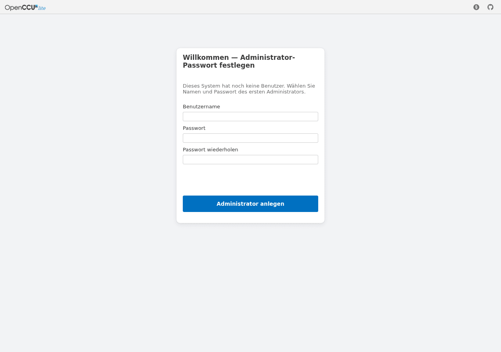

Ein frisch installiertes System hat noch keine Benutzer. Die erste Seite legt den ersten Administrator an:
Benutzername und Passwort (mindestens acht Zeichen).

### Willkommen

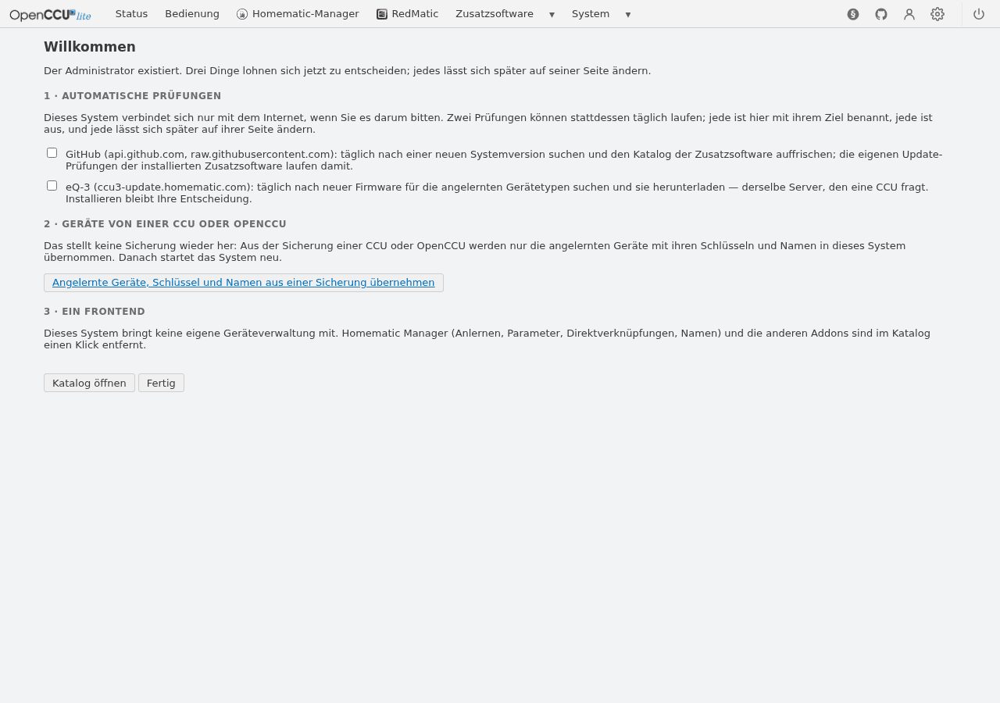

Direkt danach fragt die Willkommensseite drei Dinge, die sich später jederzeit auf ihrer eigenen Seite ändern lassen:

1. **Automatische Prüfungen.** Von sich aus verbindet sich das System nicht mit dem Internet. Zwei tägliche Prüfungen
   lassen sich hier einschalten, jede mit ihrem Ziel benannt und beide zunächst aus: GitHub (neue Systemversion,
   Katalog der Zusatzsoftware und deren eigene Update-Prüfungen) und eQ-3 (neue Firmware für die angelernten
   Gerätetypen). Was das System genau wohin sendet, steht in [privacy.md](../privacy.md).
2. **Geräte von einer CCU oder OpenCCU.** „Angelernte Geräte, Schlüssel und Namen aus einer Sicherung übernehmen“
   führt zu System → Sicherung: Dort wird die Sicherung (`.sbk`) der alten Zentrale geprüft, dann kommen die angelernten
   Geräte aller Funkschnittstellen mit ihren Schlüsseln und die Namen, Räume und Gewerke herüber. Das ist keine
   Wiederherstellung, sondern nur die Übernahme der Geräte, und es geht nur, solange auf dem neuen System noch kein
   Gerät angelernt ist; danach startet das System neu. Wenn Sie OpenCCU an Ort und Stelle gewechselt haben, sind die
   Geräte schon da und die Namen werden beim ersten Start übernommen, siehe [switching.de.md](../switching.de.md).
3. **Ein Frontend.** openccu-lite bringt keine eigene Geräteverwaltung mit; der Homematic Manager (Anlernen,
   Parameter, Direktverknüpfungen) und die anderen Addons sind im Katalog einen Klick entfernt.

## Anmeldung

Jede Seite der Oberfläche verlangt eine Anmeldung, auch die Seiten der Zusatzsoftware. Neben lokalen Benutzern kann
das System Anmeldungen über einen OpenID-Connect-Anbieter annehmen (System → Benutzer); dann erscheint hier ein
zusätzlicher Button, siehe [OpenID Connect](#openid-connect). Oben rechts stehen auch ohne Anmeldung die Lizenzen und der Link zum Projekt auf GitHub.

## Status

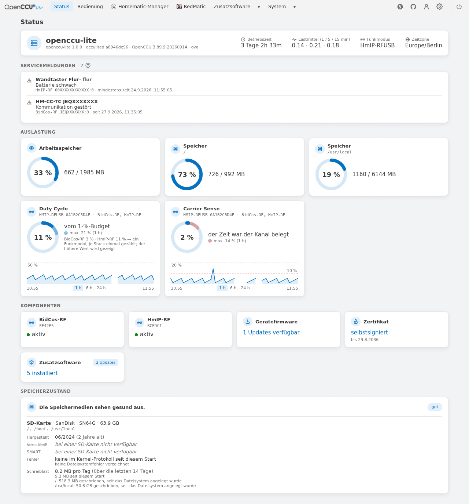

Die Startseite nach der Anmeldung. Oben der Name des Systems mit den Versionen von openccu-lite, occulited und der
OpenCCU-Basis, dazu Betriebszeit, Last, Funkmodus und Zeitzone. Darunter, wenn es welche gibt, die **Warnungen** des
Systems (etwa ein Sicherungsziel auf dem System selbst oder ein Zertifikat, das bald abläuft), jede mit einem Link auf
die Seite, die das Problem behebt, und mit der Möglichkeit, sie für eine Weile stummzuschalten.

- **Servicemeldungen** der Geräte: leere Batterie, gestörte Kommunikation und Ähnliches, mit Gerät und seit wann.
- **Auslastung:** Arbeitsspeicher, die beiden Dateisysteme, und je Funkmodul **Duty Cycle** und **Carrier Sense** mit
  ihrem Verlauf über eine Stunde, sechs oder 24 Stunden.
- **Komponenten:** die Funk-Schnittstellen, verfügbare Gerätefirmware, das Zertifikat und die installierte
  Zusatzsoftware mit ihren Updates; jede Kachel führt auf ihre Seite.
- **Speicherzustand:** Alter, Abnutzung, Fehler und Schreiblast der Speichermedien, etwa der SD-Karte.

## Bedienung

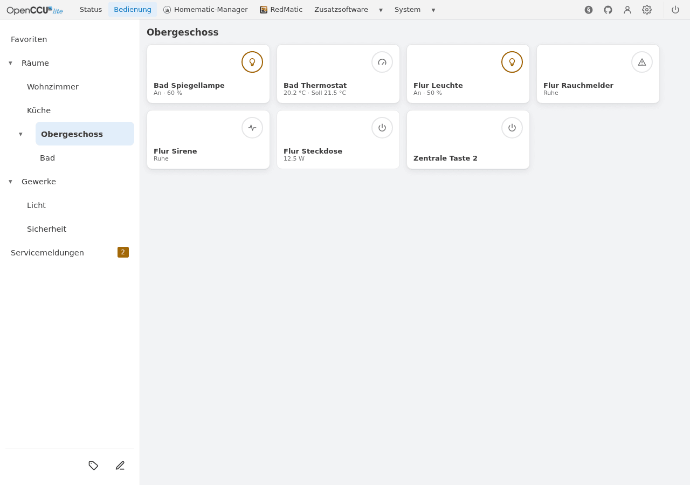

**Bedienung** ist die eingebaute Oberfläche, mit der Sie das Haus bedienen. Links die Favoriten, die Räume und Gewerke
als aufklappbarer Baum und die Servicemeldungen; rechts die Kanäle des gewählten Raums oder Gewerks als Kacheln, mit
ihrem Zustand (an, 60 %, 20,2 °C …). Ein Klick auf den runden Knopf schaltet einen Kanal direkt, ein Klick auf die
Kachel öffnet seine Bedienung:

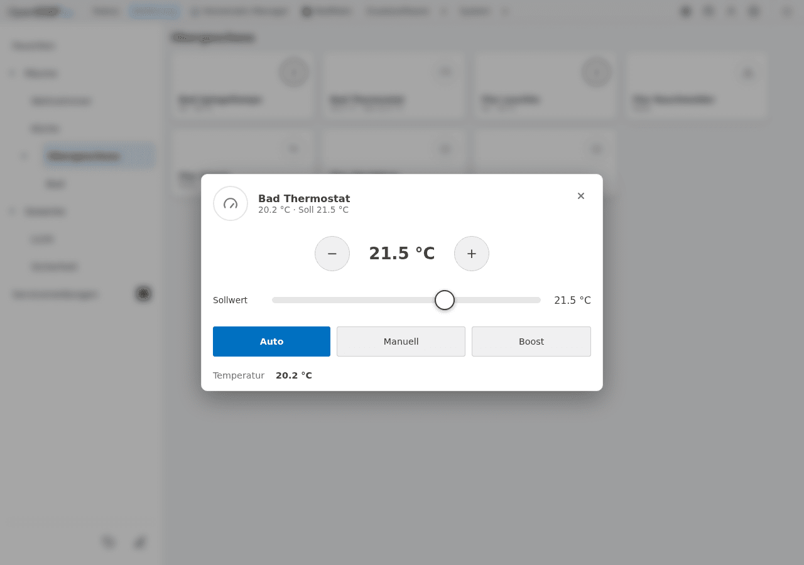

Ein Thermostat zeigt Soll- und Isttemperatur und die Betriebsarten, ein Dimmer seinen Helligkeitsregler, eine
Farbleuchte Farbe und Farbtemperatur. Auf dem Telefon wird aus dem Baum links eine Schublade hinter einem runden Knopf.
Wie Kanäle zu Namen, Räumen und Gewerken kommen, zeigt der Abschnitt
[Namen, Räume und Gewerke](#namen-räume-und-gewerke). Unter Einstellungen lässt sich die Bedienung zur Startseite
machen, ohne Kopfleiste als ganzes Fenster zeigen, aus der Kopfleiste nehmen oder ohne Anmeldung freigeben.

## Das System-Menü

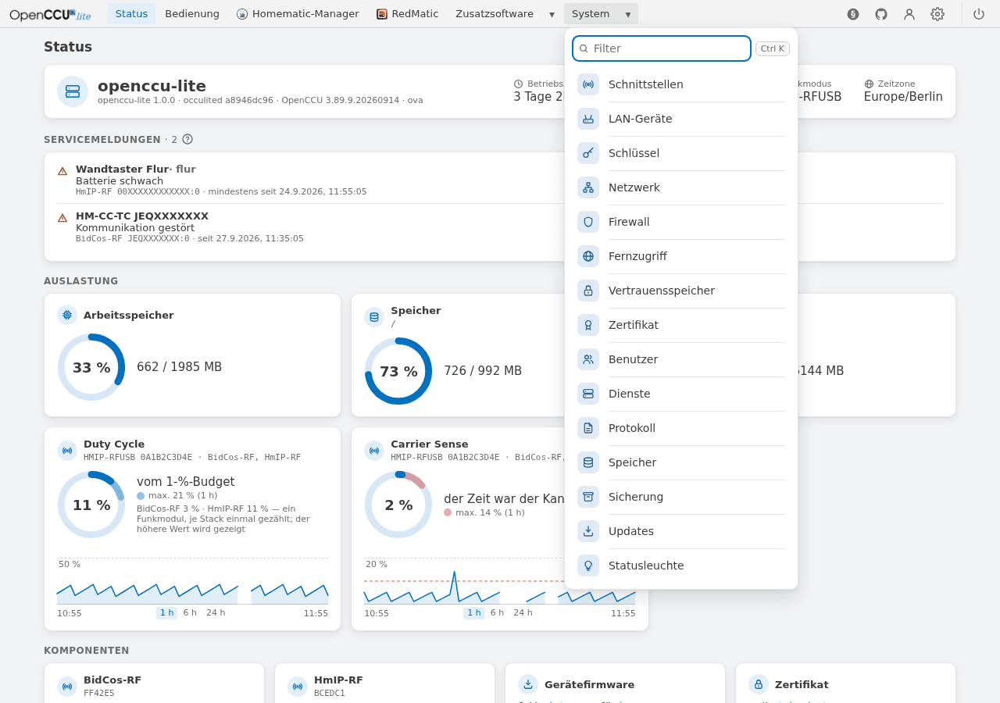

Alles, was das System selbst betrifft, liegt hinter **System** in der Kopfleiste. Das Menü hat oben ein Filterfeld
(auch mit Strg+K bzw. ⌘+K zu öffnen), das die Seiten nicht nur nach ihrem Namen findet: „ACME“ findet das Zertifikat,
„OIDC“ die Benutzer, „systemd“ die Dienste. Ein Punkt neben einem Eintrag zeigt, dass eine Warnung auf diese Seite
verweist. Jede Seite hat ihre eigene Adresse unter `/system/…` und lässt sich direkt verlinken; die kleinen
Fragezeichen an den Abschnitten erklären, was dort passiert.

### Schnittstellen

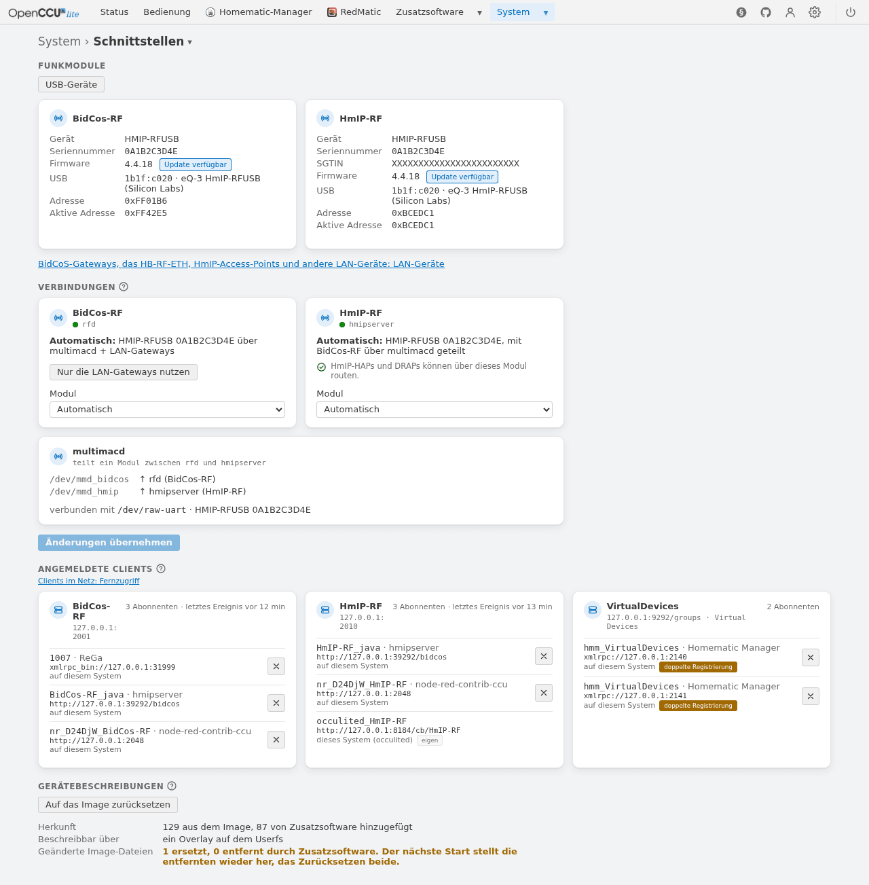

Die Funktechnik des Systems:

- **Funkmodule:** welches Modul erkannt wurde (RPI-RF-MOD, HmIP-RFUSB, HM-MOD-RPI-PCB …), mit Seriennummer, Firmware,
  Funkadresse und USB-Kennung; „USB-Geräte“ zeigt den ganzen USB-Baum.
- **Verbindungen:** welche Schnittstelle (BidCos-RF, HmIP-RF) über welches Modul funkt, automatisch oder von Hand
  gewählt, und ob sich ein Modul über `multimacd` beide Protokolle teilt.
- **Angemeldete Clients:** wer sich bei `rfd` und `hmipserver` für Ereignisse registriert hat (Addons, Node-RED,
  Home Assistant …), ob er erreichbar ist, und doppelte Registrierungen; ein Client lässt sich hier abmelden.
- **Gerätebeschreibungen:** was Addons an Gerätebeschreibungen hinzugefügt oder ersetzt haben, mit dem Weg zurück auf
  den Stand des Images.

### LAN-Geräte

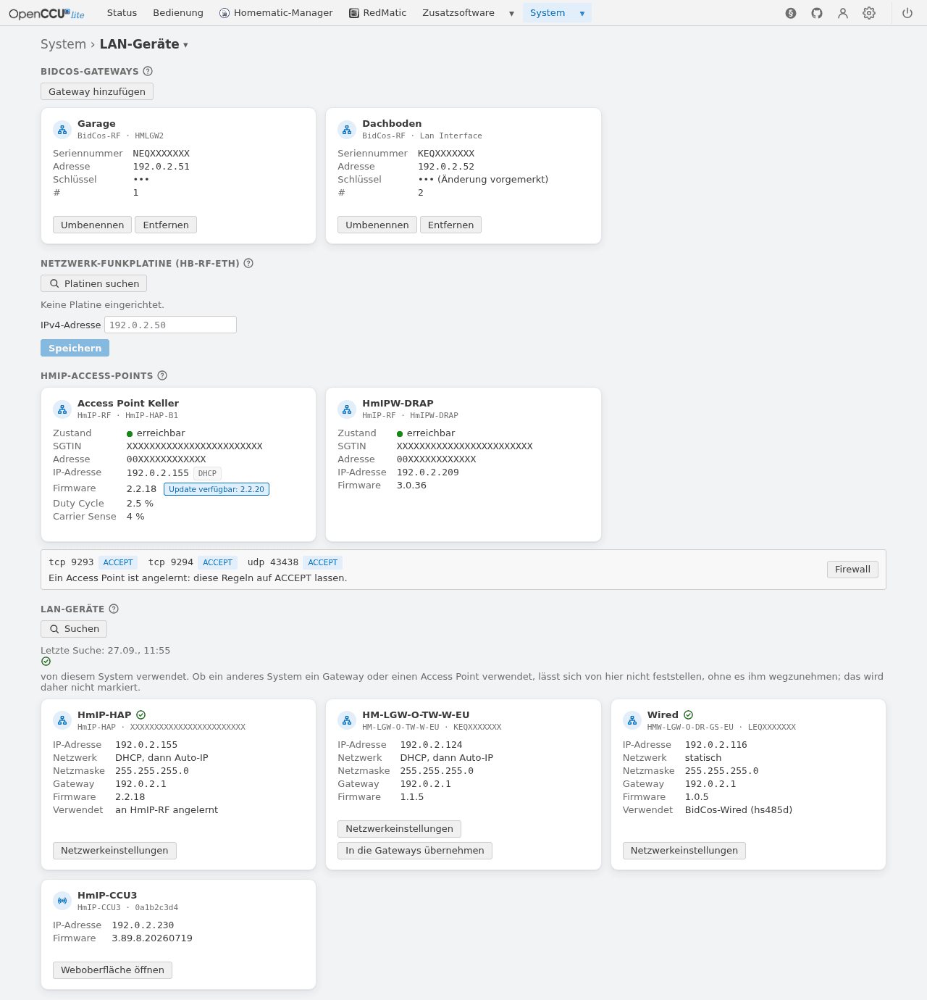

Alles, worüber das System über das Netzwerk funkt: **BidCoS-Gateways** (HM-LGW, HMW-LGW) mit Hinzufügen, Umbenennen,
Entfernen und ihrem Schlüssel, die Netzwerk-Funkplatine **HB-RF-ETH**, die **HmIP-Access-Points** (HAP, DRAP) mit
Zustand, Firmware und den Firewall-Regeln, die sie brauchen, und eine **Suche** nach eQ-3-Geräten im lokalen Netz.
Gefundene Gateways lassen sich direkt übernehmen und ihre Netzwerkeinstellungen ändern.

### Schlüssel

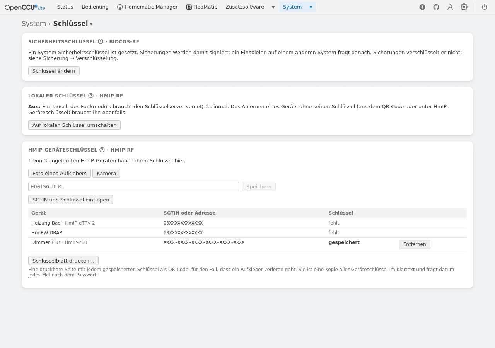

Die drei Arten von Schlüsseln:

- der **Sicherheitsschlüssel** von BidCos-RF (der „Zentralenschlüssel“), mit dem auch Sicherungen signiert werden;
- der **lokale Schlüssel** von HmIP-RF: damit braucht ein Tausch des Funkmoduls den Schlüsselserver von eQ-3 nicht
  mehr;
- die **HmIP-Geräteschlüssel** aus dem QR-Code auf den Geräten: per Foto eines Aufklebers, mit der Kamera oder
  eingetippt. „Schlüsselblatt drucken“ erzeugt eine Seite mit allen gespeicherten Schlüsseln als QR-Codes, für den
  Fall, dass ein Aufkleber verloren geht.

### Netzwerk

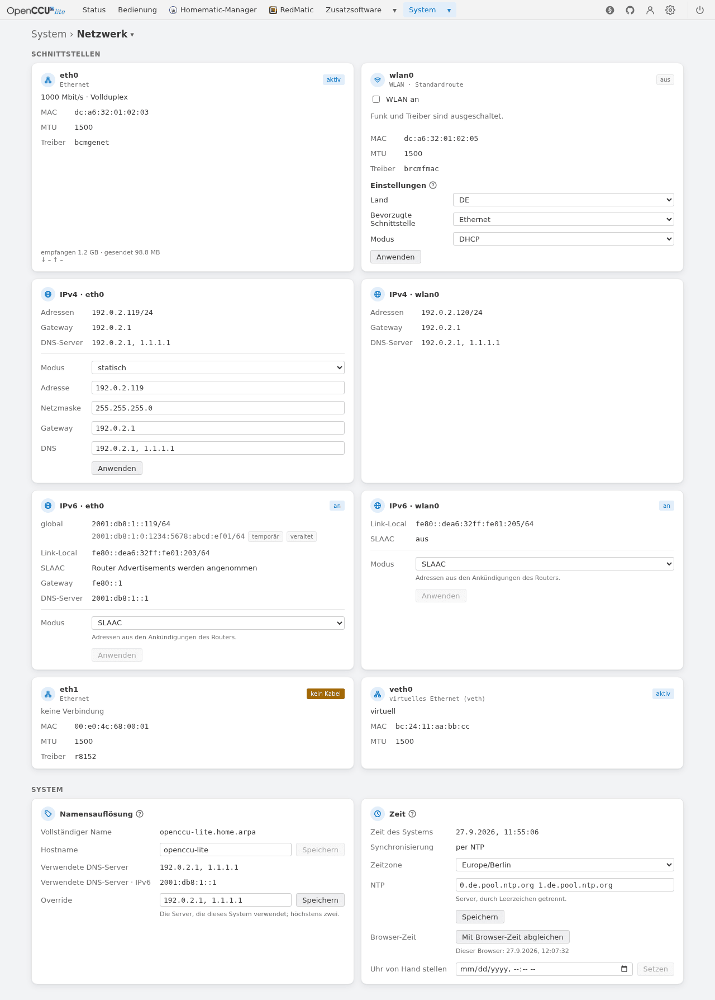

Jede Netzwerkschnittstelle mit Verbindung, MAC-Adresse und Treiber, darunter IPv4 und IPv6 je Schnittstelle: die
aktuellen Adressen und die Einstellung (DHCP oder statisch; für IPv6 aus, SLAAC, DHCPv6 oder statisch). Ein Raspberry Pi mit WLAN
bekommt hier auch das **WLAN**: Land, bevorzugte Schnittstelle, Netz und Modus. Unten **Namensauflösung**
(Hostname, DNS-Server) und **Zeit** (Zeitzone, NTP-Server, Abgleich mit der Uhr des Browsers oder von Hand).

### Firewall

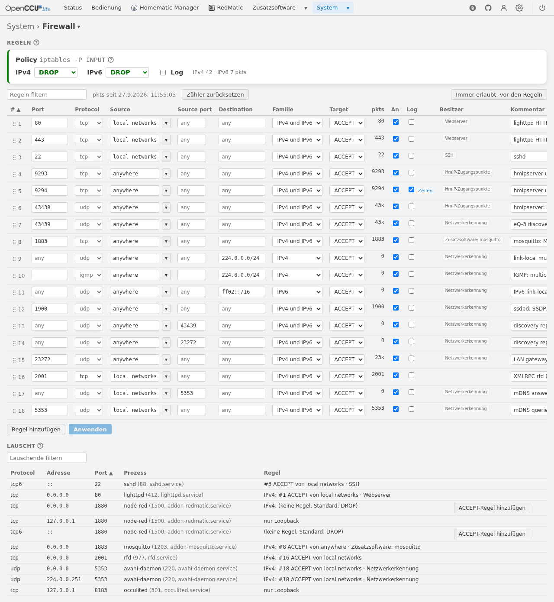

Die Firewall des Systems als Tabelle von Regeln, so wie `iptables` sie kennt: Port, Protocol, Source, Destination,
Target und je Regel ein Zähler, ob sie greift. Die **Policy** gilt für alles, wofür keine Regel passt. Regeln lassen
sich hinzufügen, ändern, sortieren, protokollieren und abschalten; Regeln, die zu einem Addon, dem Webserver oder den
Access Points gehören, sind mit ihrem **Besitzer** gekennzeichnet. „Immer erlaubt, vor den Regeln“ zeigt, was das
System vor der Tabelle zulässt (etwa Loopback und bestehende Verbindungen). Der Abschnitt **Lauscht** listet jeden
offenen Port mit seinem Prozess und der Regel, die ihn erreicht, und bietet für einen blockierten Port direkt eine
ACCEPT-Regel an. Mehr dazu in [security.md](../security.md).

### Fernzugriff

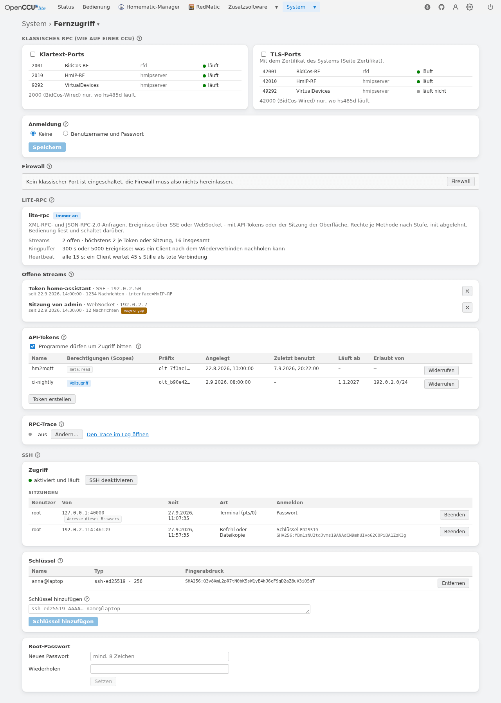

Alles, womit andere Programme auf das System zugreifen:

- **Klassisches RPC** wie auf einer CCU (Ports 2001, 2010, 9292 und ihre TLS-Varianten) für ioBroker, Home Assistant,
  Node-RED und andere; standardmäßig aus, auf Wunsch mit Benutzername und Passwort. Die Seite zeigt, ob die Firewall
  die eingeschalteten Ports hereinlässt.
- **lite-rpc**, die neue Schnittstelle: XML-RPC und JSON-RPC mit API-Tokens und Ereignissen über SSE oder WebSocket,
  mit den gerade offenen Streams.
- **API-Tokens** für Programme, mit Berechtigungen (Scopes), Ablaufdatum und erlaubten Adressen; auf Wunsch dürfen
  Programme selbst um einen Token bitten, den Sie dann freigeben.
- **RPC-Trace**, der den RPC-Verkehr für eine Weile ins Protokoll schreibt.
- **SSH:** ein- und ausschalten, offene Sitzungen, die Schlüssel für `root` und das Root-Passwort.

### Vertrauensspeicher

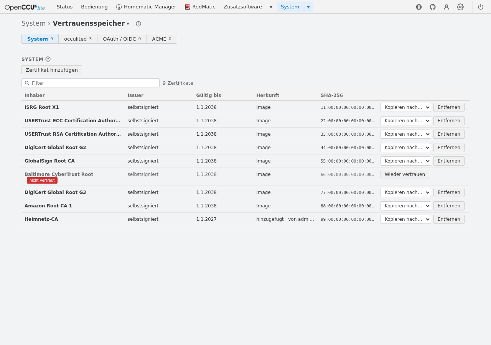

Die Zertifizierungsstellen, denen das System vertraut, getrennt nach Verwendung: das System selbst, occulited, die
Anmeldung über OAuth/OpenID Connect und ACME. Eine eigene CA (etwa die des Heimnetzes) lässt sich hinzufügen, eine
mitgelieferte auf „nicht vertraut“ setzen und wieder zurückholen, und ein Eintrag in einen anderen Speicher kopieren.

### Zertifikat

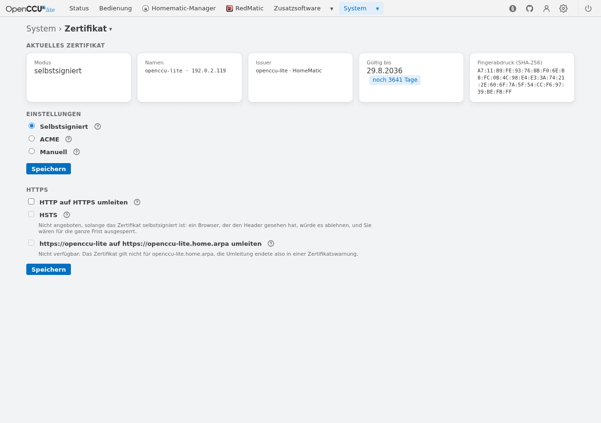

Das Zertifikat, mit dem die Weboberfläche über HTTPS erreichbar ist: **selbstsigniert** (der Ausgangszustand),
per **ACME** von Let's Encrypt oder einer eigenen CA (HTTP- oder DNS-Challenge, mehrere DNS-Anbieter) oder **manuell**
hochgeladen. Darunter die HTTPS-Einstellungen: HTTP auf HTTPS umleiten, HSTS (erst mit einem nicht selbstsignierten
Zertifikat) und die Umleitung vom kurzen Namen auf den vollständigen. Details in [tls-acme.md](../tls-acme.md).

#### Mit ACME

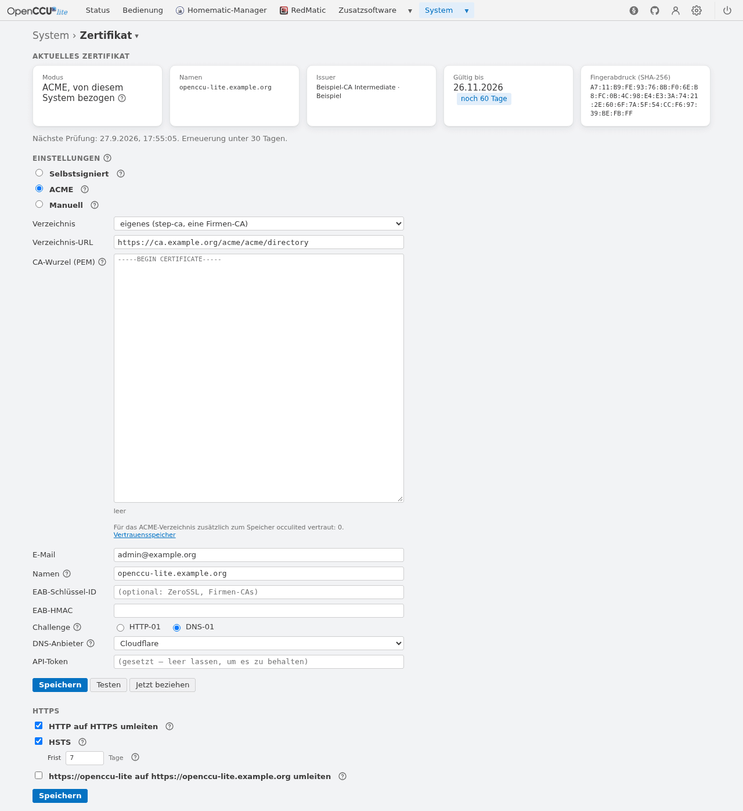

So sieht die Seite aus, wenn das System sein Zertifikat per ACME bezieht, hier von einer eigenen CA
(`https://ca.example.org/acme/acme/directory`) für den Namen `openccu-lite.example.org`. Sie geben das Verzeichnis
(Let's Encrypt, ZeroSSL oder eine eigene CA mit ihrem Stammzertifikat), eine E-Mail-Adresse, die Namen und die Challenge
an: HTTP-01, oder DNS-01 über einen der DNS-Anbieter mit seinem API-Token. „Testen“ spielt den ganzen Ablauf gegen das
Staging-Verzeichnis durch, ohne etwas zu installieren; „Jetzt beziehen“ holt das Zertifikat, danach verlängert das
System es selbst, wenn es weniger als 30 Tage gilt. Mit einem solchen Zertifikat lassen sich auch HSTS und die
Umleitung auf den vollständigen Namen einschalten.

### Benutzer

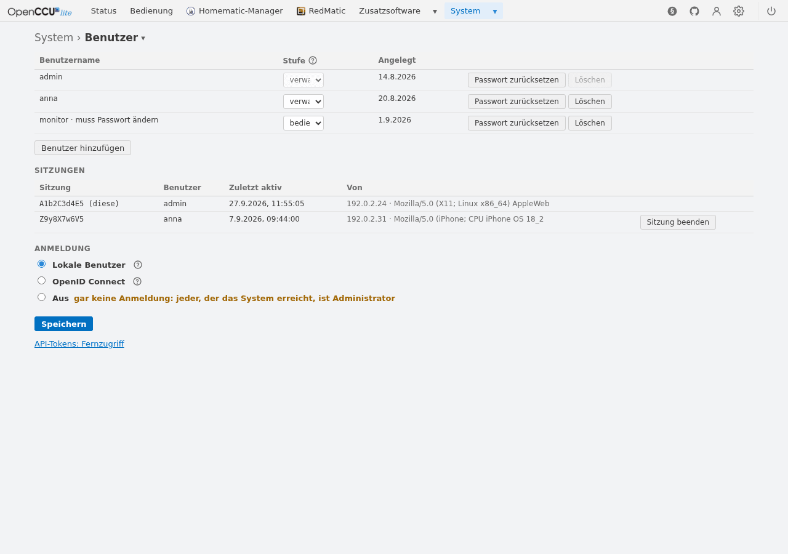

Die Benutzerkonten mit ihrer **Stufe**: *lesen* (sieht alles, ändert nichts), *bedienen* (schaltet und setzt Werte),
*konfigurieren* (auch Namen, Räume, Gewerke und Favoriten) und *verwalten* (alles, auch die Systemseiten). Passwörter
lassen sich zurücksetzen, die offenen **Sitzungen** aller Benutzer einsehen und beenden. Unter **Anmeldung** wählen Sie
zwischen lokalen Benutzern und OpenID Connect (Single Sign-on über einen eigenen Anbieter); „Aus“ schaltet jede
Anmeldung ab, dann ist jeder, der das System erreicht, Administrator.

#### OpenID Connect

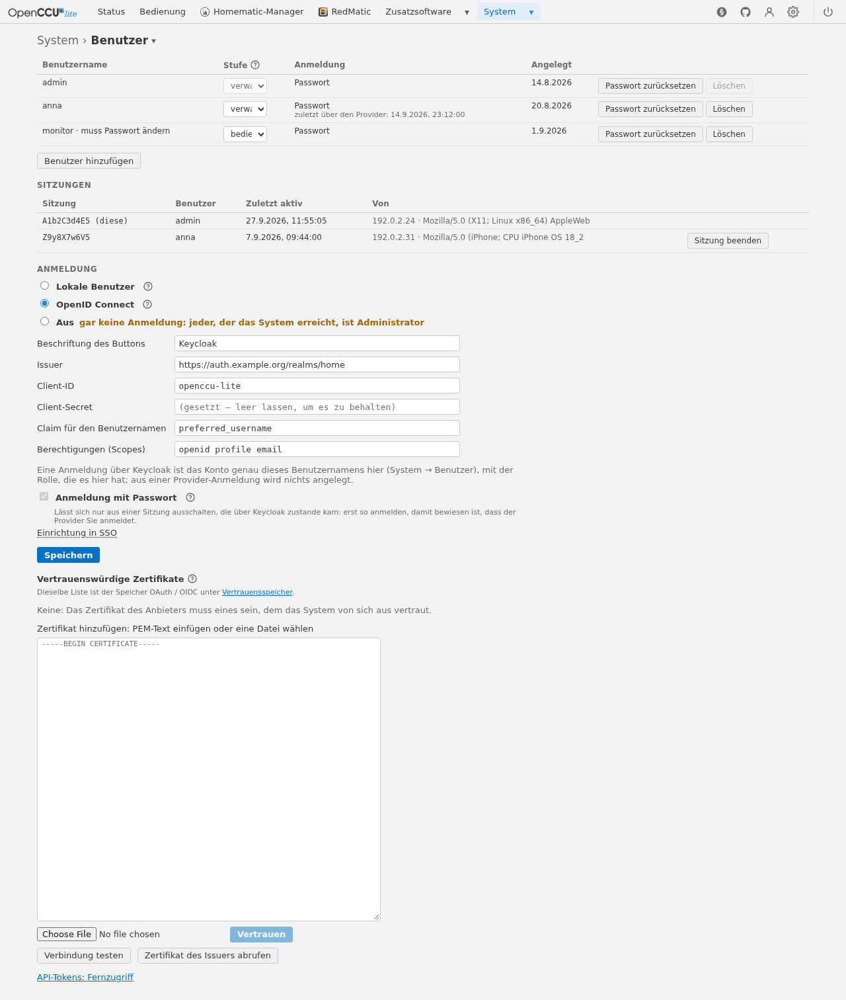

Mit **OpenID Connect** melden sich Benutzer über einen eigenen Anbieter an, etwa Keycloak oder Authentik; im Bild ein
Beispiel-Keycloak unter `https://auth.example.org/realms/home`. Sie tragen die Beschriftung des Buttons, den Issuer,
Client-ID und Client-Secret, den Claim für den Benutzernamen und die Scopes ein; „Verbindung testen“ prüft die
Einstellungen gegen den Anbieter. Eine Anmeldung über den Anbieter gehört zum Konto mit genau diesem Benutzernamen und
bekommt dessen Stufe; ein neues Konto legt sie nicht an. Die Anmeldung mit Passwort lässt sich abschalten, aber nur aus
einer Sitzung, die über den Anbieter zustande kam. Vertraut das System dem Zertifikat des Anbieters nicht von sich aus,
lässt sich dessen CA hier (oder unter Vertrauensspeicher → OAuth / OIDC) hinzufügen.

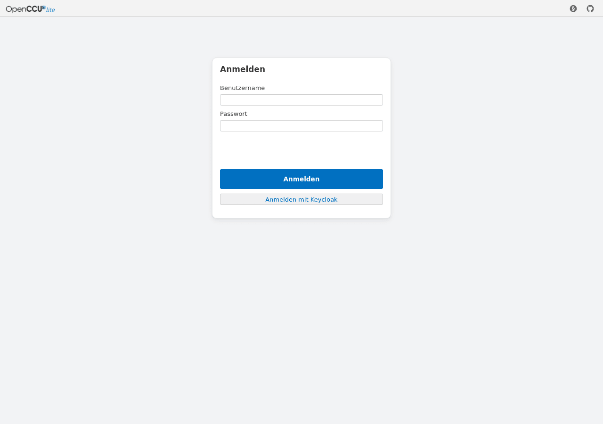

Die Anmeldeseite bietet dann zusätzlich den Button des Anbieters an.

### Dienste

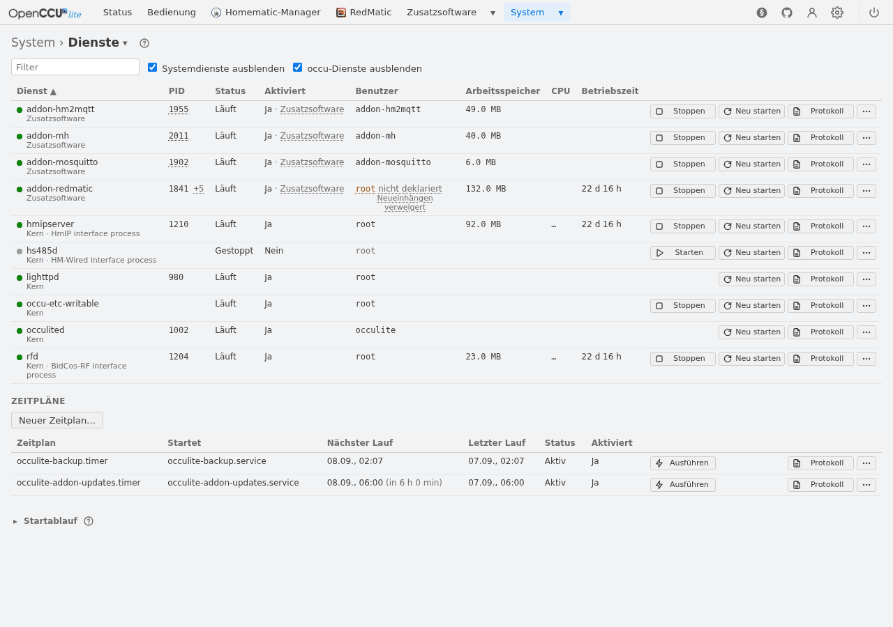

Die systemd-Dienste des Systems mit Status, Benutzer, Speicher- und CPU-Verbrauch und Betriebszeit: die Funkdienste
(`rfd`, `hmipserver`, `hs485d`), der Webserver, occulited und jede Zusatzsoftware. Dienste lassen sich starten,
stoppen, neu starten und ihr Protokoll öffnen; das Menü „…“ bietet mehr, etwa die Unit-Datei. Bei einem Addon zeigt die
Spalte Benutzer, ob es eingesperrt unter einem eigenen Benutzer läuft oder als `root`. Darunter die **Zeitpläne**
(systemd-Timer, auch eigene) und der **Startablauf** des letzten Systemstarts.

#### Startablauf

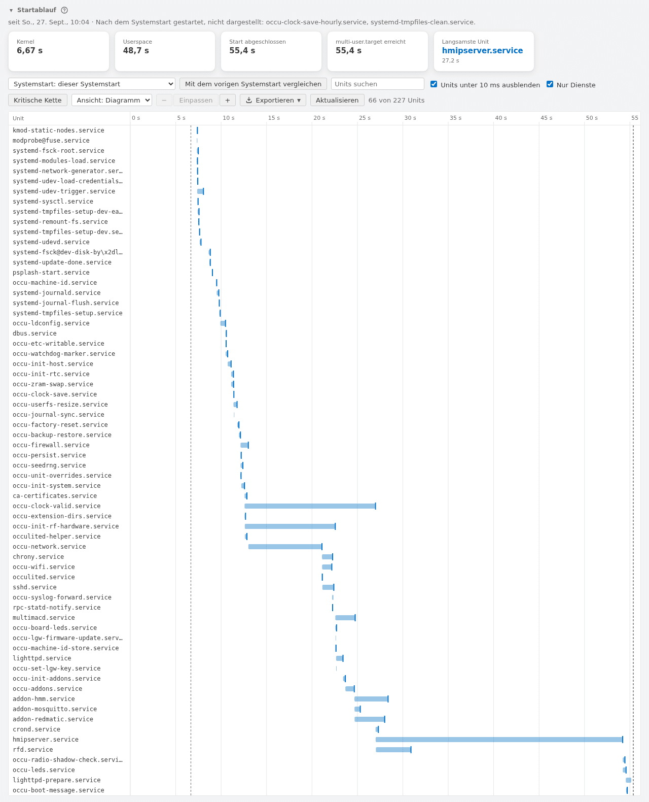

Der Startablauf zeigt, wann beim Systemstart welcher Dienst gestartet wurde (Beginn des Balkens) und wann er bereit
war (Ende des Balkens), auf einer Zeitachse ab dem Einschalten; oben die Dauer von Kernel und Userspace und die
langsamste Unit. Sie können einen früheren Systemstart wählen, mit dem vorigen vergleichen, nach Units suchen, die
kritische Kette anzeigen und das Diagramm exportieren. Das Bild stammt von einem echten System: Die Zusatzsoftware
(`addon-hmm`, `addon-mosquitto`, `addon-redmatic`) startet nach etwa 25 Sekunden, **vor** `rfd` und `hmipserver`,
und `hmipserver` ist erst nach gut 54 Sekunden bereit. Das ist der **frühe Start der Zusatzsoftware** (Zusatzsoftware →
Start der Zusatzsoftware): Addons, die damit umgehen können, dass die Funk-Schnittstellen noch nicht bereit sind,
starten vor ihnen und verbinden sich, sobald die Schnittstellen da sind. So sind etwa Node-RED oder der Homematic
Manager schon erreichbar, während `hmipserver` noch lädt, und das System ist insgesamt früher nutzbar.

### Protokoll

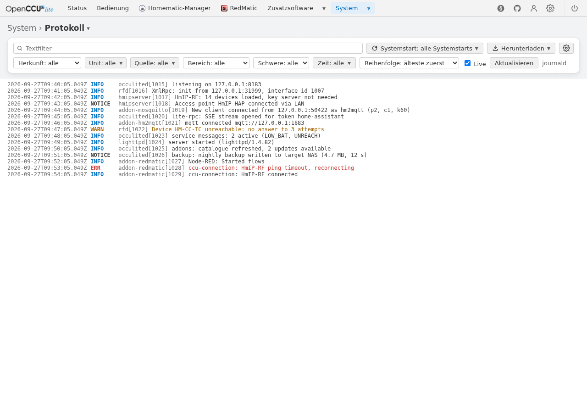

Das Systemprotokoll (Journal) mit Filtern nach Text, Herkunft, Unit, Quelle, Bereich, Schwere und Zeit, live oder
von einem früheren Systemstart, und zum Herunterladen. Das Zahnrad öffnet die Einstellungen: die Protokollstufen der
Funkdienste und von occulited sowie wo und wie lange das Journal gespeichert wird.

#### Protokoll-Einstellungen

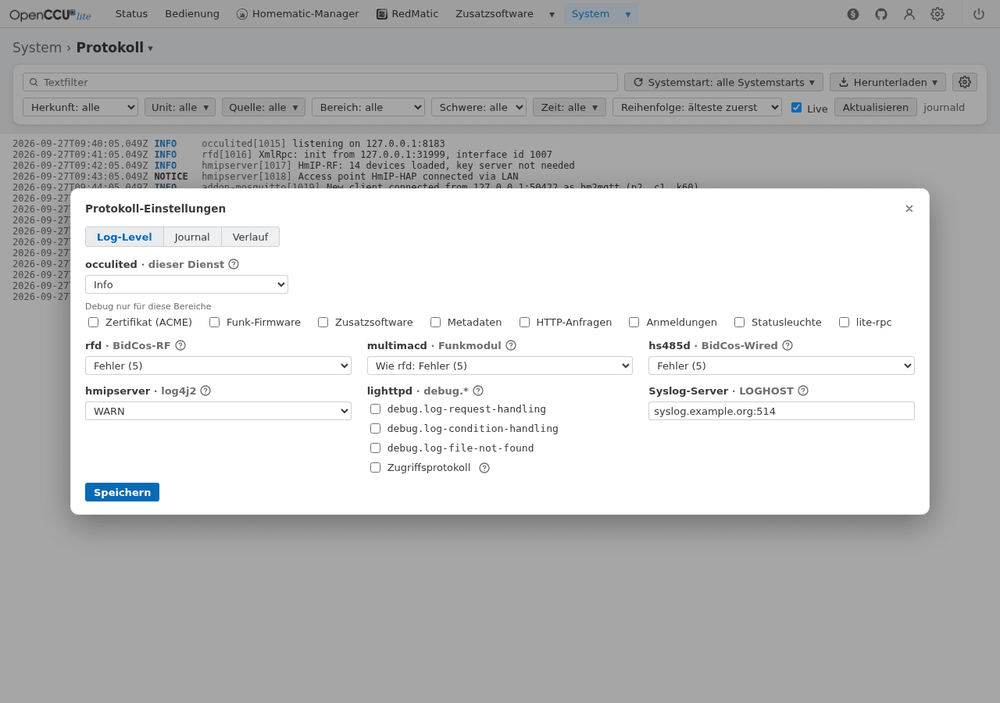

**Log-Level:** wie ausführlich occulited protokolliert (auf Wunsch mit Debug-Ausgaben nur für einzelne Bereiche wie
ACME, Funk-Firmware oder lite-rpc), die Stufen von `rfd`, `multimacd`, `hs485d` und `hmipserver` sowie die
Debug-Schalter und das Zugriffsprotokoll von `lighttpd`. **Syslog-Server** schickt das Protokoll zusätzlich an einen
Syslog-Server im Netz (`host` oder `host:port`), etwa an eine zentrale Protokollsammlung.

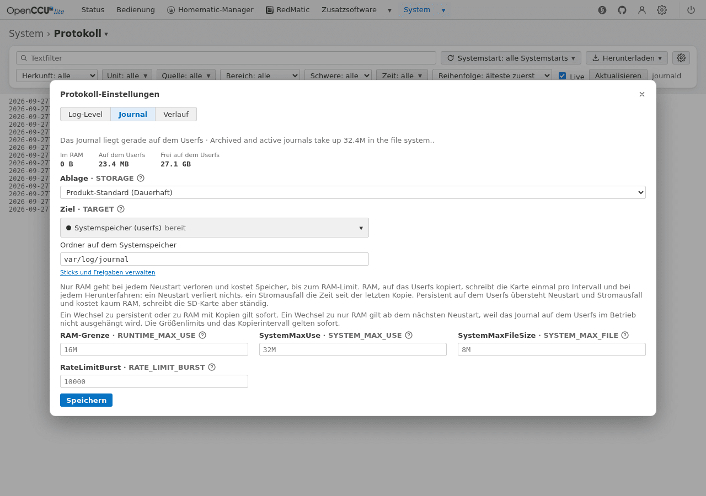

**Journal:** wo das Systemprotokoll liegt. Die **Ablage** hat drei Stufen:

- **Nur RAM:** geht bei jedem Neustart verloren, schont aber den Speicher vollständig. Für Systeme, bei denen das
  Protokoll nach einem Neustart nicht gebraucht wird.
- **RAM, auf das Userfs kopiert** (ram-sync): das Journal liegt im RAM und wird in einem festen Intervall und bei jedem
  Herunterfahren kopiert. Ein Neustart verliert nichts, ein Stromausfall höchstens die Zeit seit der letzten Kopie. Die
  schonende Wahl für einen Raspberry Pi mit **SD-Karte**, die nur einmal pro Intervall beschrieben wird.
- **Persistent auf dem Userfs:** übersteht Neustart und Stromausfall und braucht kaum RAM, schreibt aber ständig. Das
  passt zu einer **VM (OVA)** oder einer SSD, wo das nicht schadet; auf der VM ist es die Voreinstellung.

Dazu die Größengrenzen (RAM-Grenze, SystemMaxUse, SystemMaxFileSize) und die Rate-Begrenzung, jeweils mit den Namen der
journald-Optionen.

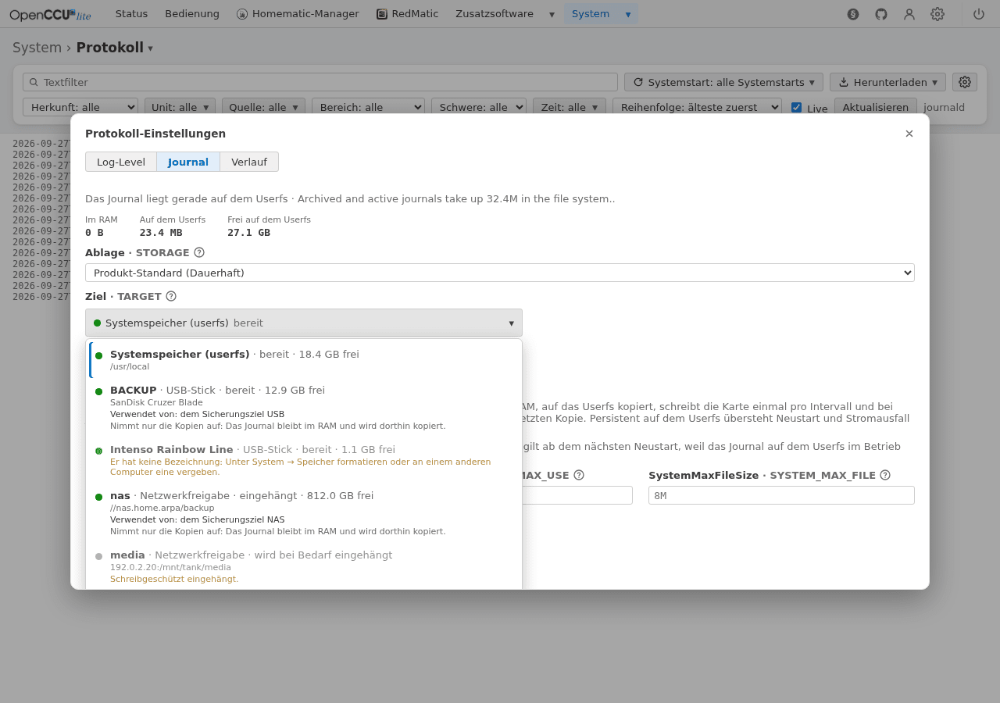

Als **Ziel** der Kopien kommt statt des Systemspeichers auch ein **USB-Stick** oder eine **Netzwerkfreigabe** in
Frage (unter System → Speicher eingerichtet). Das Journal bleibt dann im RAM und wird dorthin kopiert: So wird die
SD-Karte gar nicht beschrieben, und das Protokoll überlebt auch den Tausch der Karte. Die Liste zeigt je Ziel, ob es
bereit ist, wie viel Platz frei ist und wofür es schon verwendet wird.

### Speicher

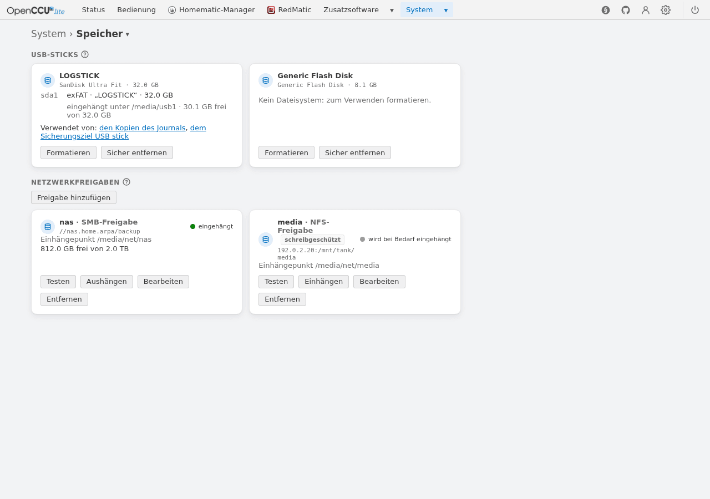

Angesteckte **USB-Sticks** (formatieren, sicher entfernen, und wofür sie gerade verwendet werden) und
**Netzwerkfreigaben** (SMB oder NFS), die das System einhängt, etwa als Ziel für Sicherungen oder die Kopien des
Journals.

### Sicherung

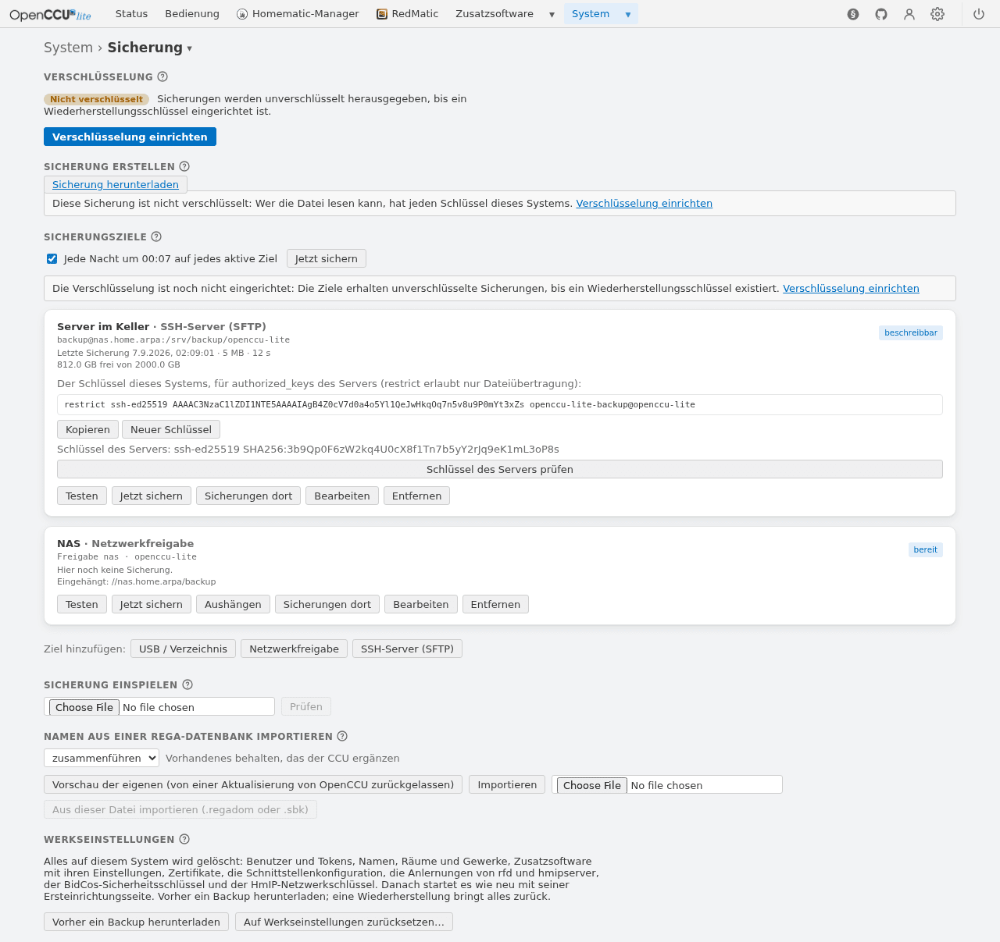

- **Verschlüsselung:** mit einem Wiederherstellungsschlüssel werden Sicherungen verschlüsselt; ohne ihn enthält eine
  Sicherung jeden Schlüssel des Systems im Klartext.
- **Sicherung erstellen:** eine Sicherung sofort herunterladen.
- **Sicherungsziele:** jede Nacht automatisch auf ein USB-Verzeichnis, eine Netzwerkfreigabe oder einen SSH-Server
  (SFTP), mit Test, „Jetzt sichern“ und der Liste der Sicherungen dort.
- **Sicherung einspielen:** eine Sicherung prüfen und wiederherstellen, auch die einer CCU oder von OpenCCU.
- **Angelernte Geräte übernehmen:** aus einer geprüften Sicherung einer CCU oder von OpenCCU nur die angelernten
  Geräte mit ihren Schlüsseln, ohne den Rest wiederherzustellen; nur auf einem System ohne angelernte Geräte. Eine
  Aktion übernimmt alle drei: zuerst die Namen, Räume und Gewerke der ReGa-Datenbank der Sicherung, dann die Geräte mit
  ihren Schlüsseln, dann der Neustart. Das Panel sagt vorher, wenn die HmIP-Identität der Sicherung zu einem anderen
  Funkmodul gehört (hmipserver übernimmt sie beim Start auf das Modul dieses Systems; die Seite Schnittstellen zeigt
  danach, wie es ausging) und wenn die Sicherung einen eigenen BidCos-Sicherheitsschlüssel hat (er kommt so mit, eine
  Passphrase wird nicht abgefragt).
- **Namen aus einer ReGa-Datenbank importieren:** Gerätenamen, Räume und Gewerke aus einer alten CCU-Datenbank oder
  einer Sicherung übernehmen.
- **Werkseinstellungen:** alles löschen und neu mit der Einrichtungsseite beginnen.

### Updates

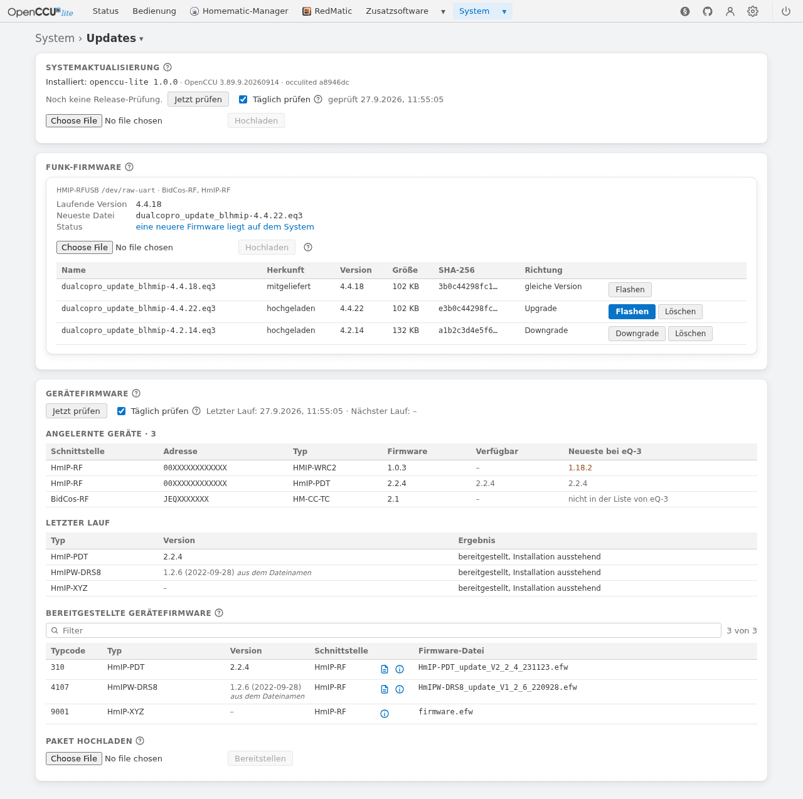

- **Systemaktualisierung:** die installierte Version, die Prüfung auf ein neues Release (auf Wunsch täglich) und das
  Hochladen eines Update-Pakets.
- **Funk-Firmware:** die Firmware des Funkmoduls, mitgelieferte und hochgeladene Versionen, Flashen, Upgrade und
  Downgrade.
- **Gerätefirmware:** die angelernten Geräte mit ihrer Firmware und der neuesten Version bei eQ-3, die bereitgestellten
  Firmware-Dateien und das Hochladen eigener Firmware-Pakete.

### Statusleuchte

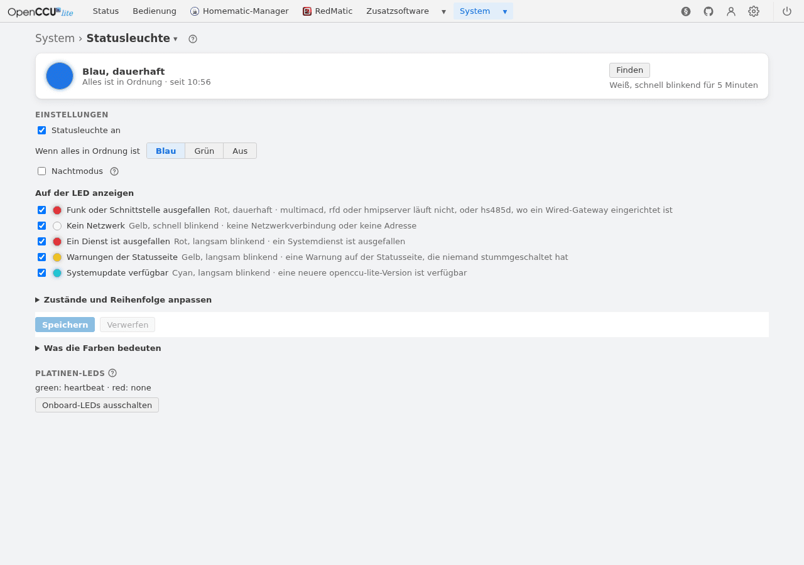

Die Statusleuchte des Funkmoduls (RPI-RF-MOD) zeigt den Zustand des Systems in Farben: blau oder grün, wenn alles in
Ordnung ist, rot, gelb oder cyan für ausgefallene Dienste, fehlendes Netzwerk, Warnungen oder ein verfügbares Update.
Welche Zustände sie zeigt und in welcher Reihenfolge lässt sich hier einstellen, dazu ein Nachtmodus, in dem sie zu
festen Zeiten nur Fehler oder gar nichts zeigt;
„Finden“ lässt sie ein paar Minuten weiß blinken, um das Gerät zu finden. Dazu die LEDs auf der Platine des Raspberry Pi.

## Beispiele für Funk-Konfigurationen

Wie Schnittstellen und LAN-Geräte bei einer bestimmten Hardware aussehen, zeigen diese Bilder von echten Systemen.
Seriennummern, SGTINs, Funkadressen, MAC- und IP-Adressen sind unkenntlich gemacht.

### HmIP-RFUSB mit einem HmIP-Access-Point

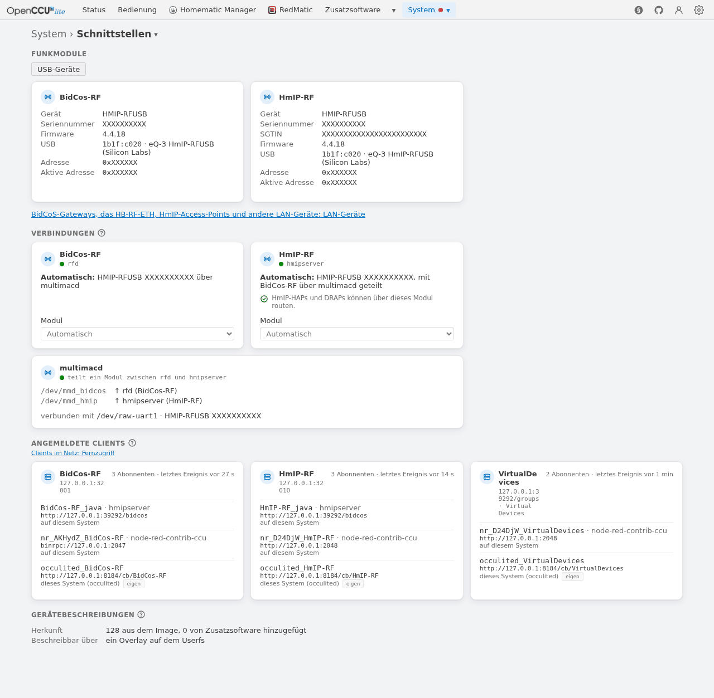

Ein Raspberry Pi 4 mit dem USB-Funkstick **HmIP-RFUSB**: Er funkt BidCos-RF und HmIP-RF zugleich, `multimacd` teilt
ihn zwischen `rfd` und `hmipserver`. Das ist die einfachste Konfiguration, ohne Funkmodul auf der Platine; sie passt
auch zu einer VM, an die der Stick durchgereicht wird.

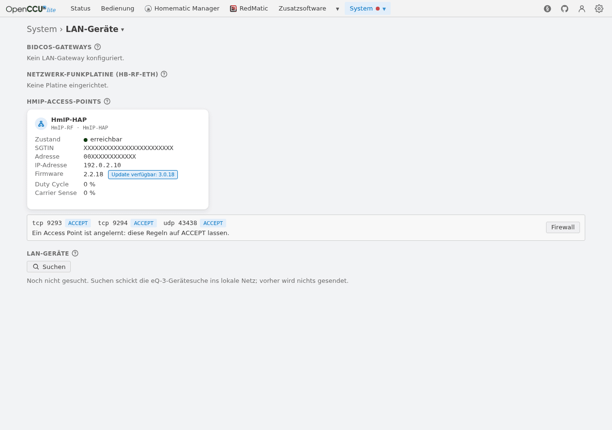

Dazu ist ein **HmIP-Access-Point** (HAP) angelernt, der die Reichweite von HmIP-RF über das Netzwerk in einen anderen
Gebäudeteil verlängert. Die Seite zeigt seinen Zustand, seine Firmware und die Firewall-Regeln, die er braucht.

### HB-RF-ETH: das Funkmodul im Netzwerk

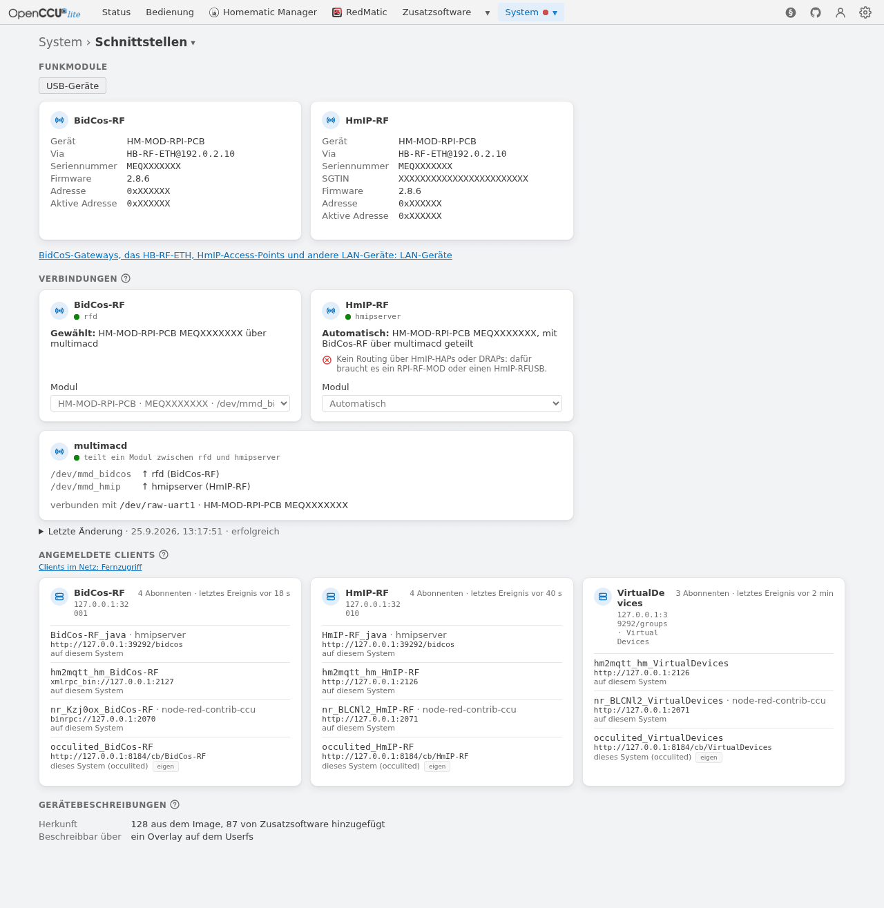

Eine VM ohne eigenes Funkmodul: Das Funkmodul HM-MOD-RPI-PCB steckt auf einer **HB-RF-ETH**, einer Platine mit
Netzwerkanschluss, und das System erreicht es über das Netzwerk („Via HB-RF-ETH“). `multimacd` teilt das Modul
zwischen BidCos-RF und HmIP-RF. Das passt, wenn die VM im Keller läuft, das Funkmodul aber an einer günstigen Stelle
im Haus stehen soll.

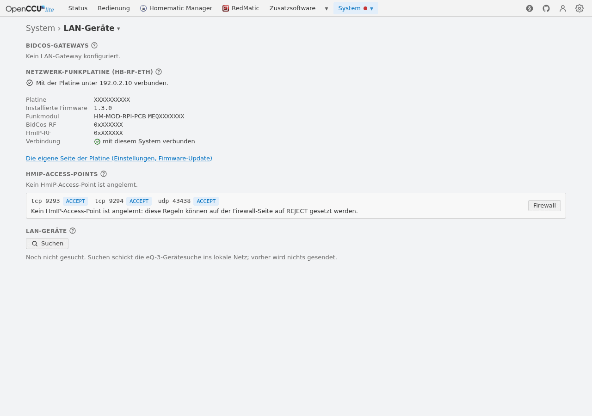

Unter LAN-Geräte steht die Platine mit ihrer Firmware, dem Funkmodul darauf und der Verbindung; der Link führt zu
ihrer eigenen Seite für Einstellungen und Firmware-Update. Die Platine verbindet sich immer nur mit einem System.

### Zwei USB-Sticks: HM-CFG-USB-2 und HmIP-RFUSB

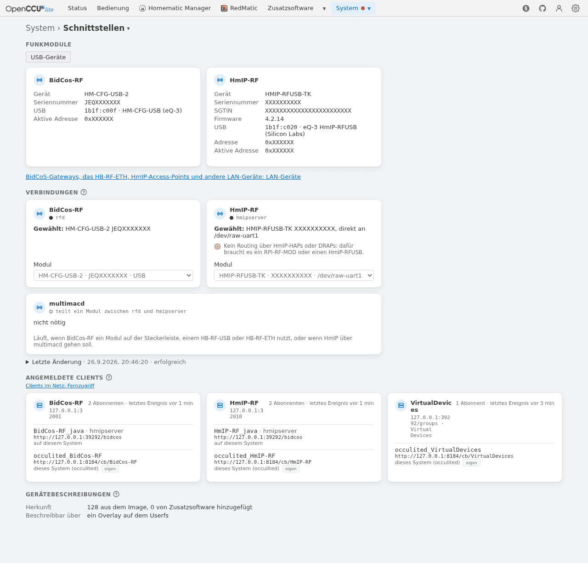

Ein Raspberry Pi mit zwei getrennten Sticks: der ältere **HM-CFG-USB-2** funkt BidCos-RF, ein **HmIP-RFUSB** HmIP-RF.
Jede Schnittstelle hat ihr eigenes Modul, `multimacd` ist nicht nötig. So lässt sich ein vorhandener BidCos-Stick
weiter nutzen; HmIP-Access-Points können über diese Kombination allerdings nicht routen.

### RPI-RF-MOD mit LAN-Gateways und Wired

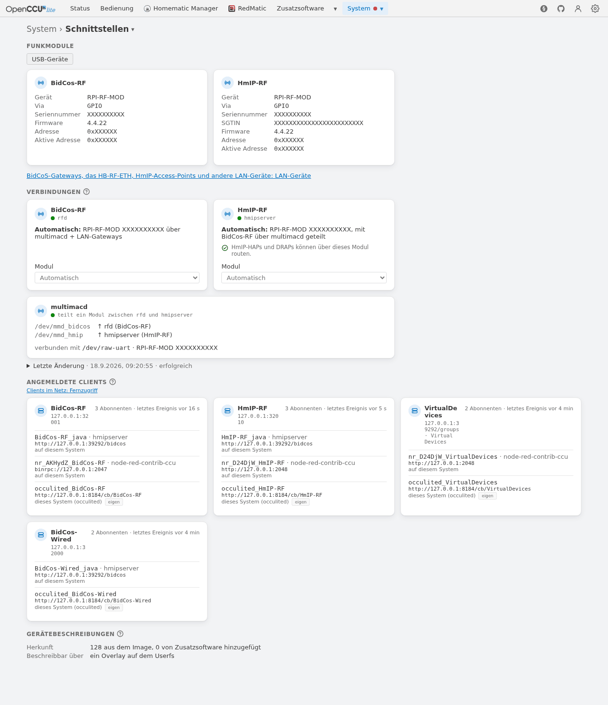

Ein Raspberry Pi mit dem Funkmodul **RPI-RF-MOD** auf der Steckerleiste (GPIO), das beide Funkprotokolle bedient, dazu
Homematic Wired: Die Schnittstelle BidCos-Wired mit `hs485d` erscheint unter den angemeldeten Clients.

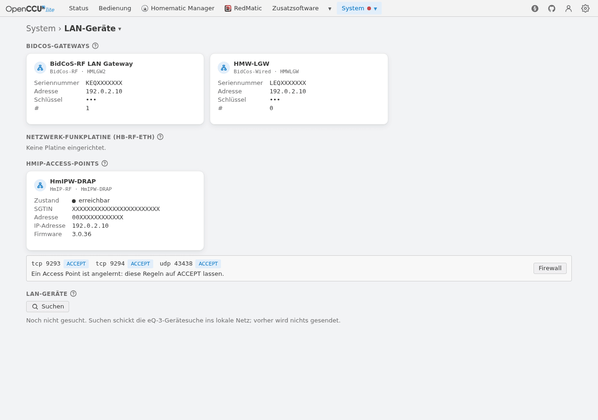

Ein **HM-LGW** (BidCos-RF LAN Gateway) erweitert die BidCos-Funkreichweite über das Netzwerk, ein **HMW-LGW** bindet
den Wired-Bus an, und ein **HmIPW-DRAP** dient als Access Point für HmIP. Das ist die Konfiguration für größere
Installationen mit mehreren Gebäudeteilen oder einem Wired-Bus aus einer älteren Anlage.

## Einstellungen, Konto, Lizenzen, Ausschalten

Die Symbole rechts in der Kopfleiste.

### Einstellungen

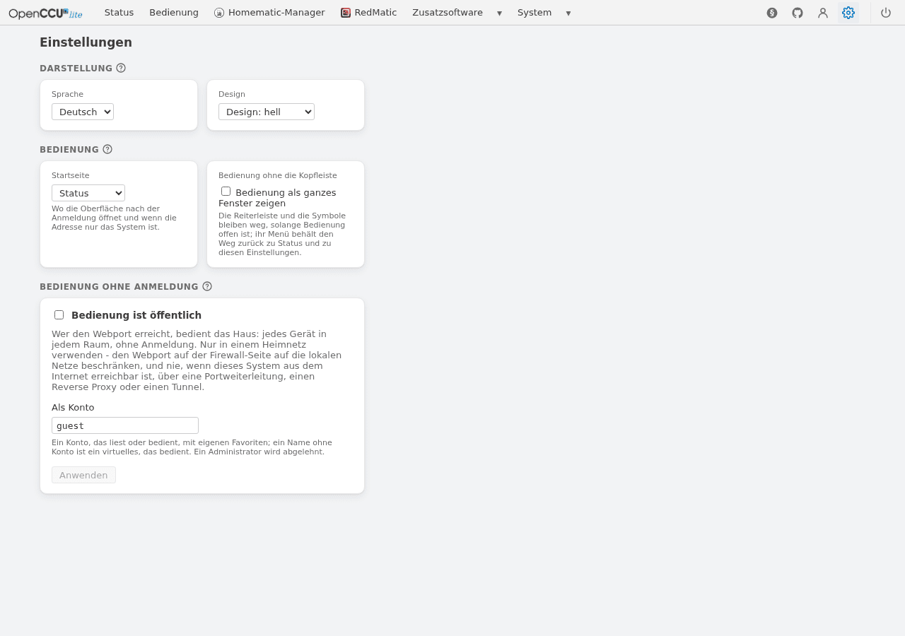

Sprache und Design (hell, dunkel oder wie das Betriebssystem es vorgibt), die Startseite nach der Anmeldung (Status oder
Bedienung), ob die Bedienung als ganzes Fenster ohne Kopfleiste erscheint und ob ihr Reiter in der Kopfleiste steht
(ausgeblendet bleibt sie unter ihrer Adresse `/app` erreichbar, und die Startseite ist dann Status). **Bedienung ohne
Anmeldung** gibt die Bedienung für jeden frei, der die Weboberfläche erreicht, unter einem Konto mit höchstens der Stufe
*bedienen*; das ist nur für ein abgeschottetes Heimnetz gedacht.

### Konto

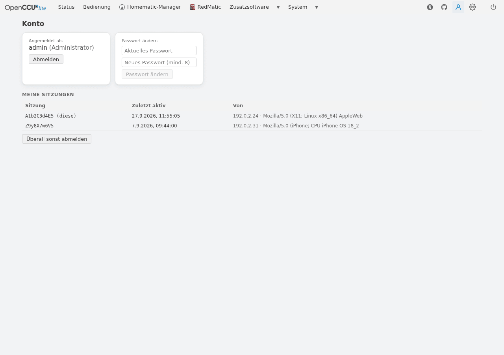

Das eigene Konto: wer angemeldet ist, Abmelden, Passwort ändern und die eigenen Sitzungen, mit „Überall sonst
abmelden“.

### Lizenzen

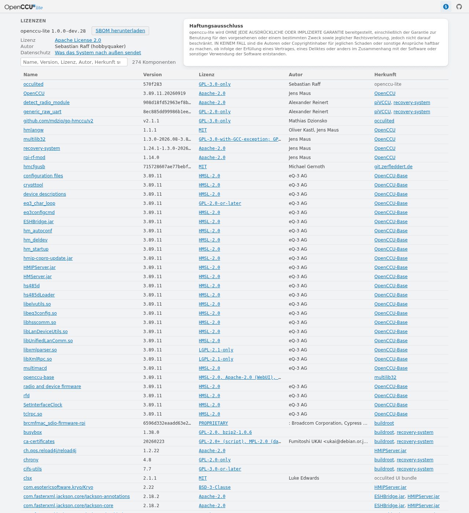

Die Version und Lizenz von openccu-lite, der Haftungsausschluss, der Link auf die Datenschutzhinweise
([privacy.md](../privacy.md)) und die Liste aller Bestandteile mit Version, Lizenz, Autor und Herkunft (im Bild nur ihr Anfang; ein System bringt
einige hundert mit, das Suchfeld filtert sie). „SBOM herunterladen“
liefert dieselbe Liste als Software Bill of Materials.

### Neu starten und Herunterfahren

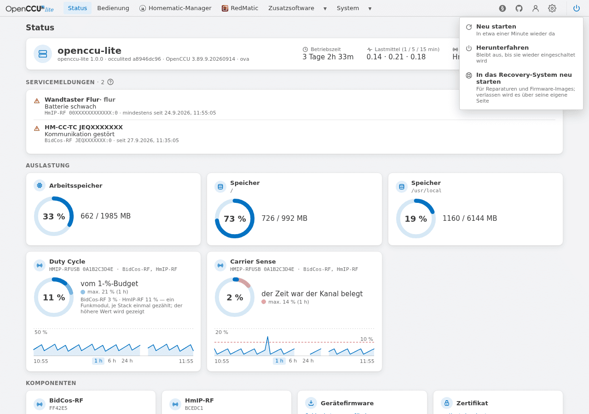

Der Knopf ganz rechts startet das System neu, fährt es herunter oder startet in das Recovery-System, das für
Reparaturen und das Einspielen von Firmware-Images gedacht ist.

## Zusatzsoftware

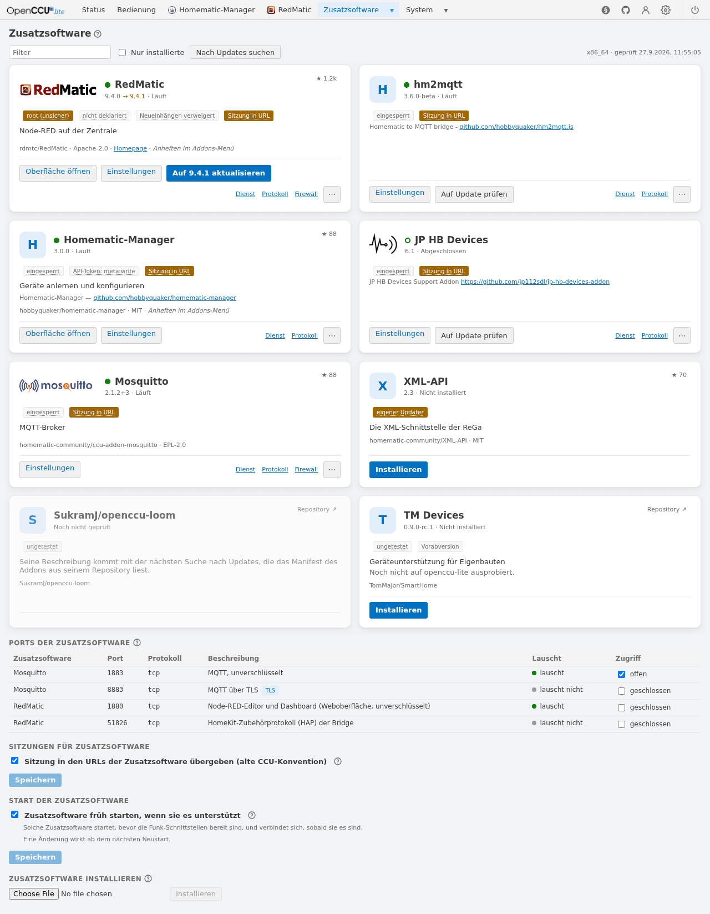

Installierte Addons und der **Katalog** auf einer Seite. Jede Karte zeigt Version, Zustand und Hinweise: ob das Addon
eingesperrt unter einem eigenen Benutzer oder als `root` läuft, ob es seine Anforderungen deklariert hat, ob es einen
API-Token bekommt. Von hier aus öffnen Sie die Oberfläche eines Addons und seine Einstellungen, installiert Updates und
springt zu seinem Dienst, seinem Protokoll und seinen Firewall-Regeln. Katalogeinträge, die noch nicht installiert
sind, installiert ein Klick. „Nach Updates suchen“ fragt den Katalog und die Addons selbst.

Darunter die **Ports der Zusatzsoftware** mit der Wahl, ob die Firewall sie öffnet, die Übergabe der Sitzung in den
Adressen der Addons (die alte CCU-Konvention, die manche Addons noch brauchen), der frühe Start der Addons, die das
unterstützen, und die Installation eines Addons aus einer Datei. Addons mit eigener Oberfläche lassen sich im Menü
neben „Zusatzsoftware“ anheften und öffnen dann innerhalb der Oberfläche. Mehr in [addons.md](../addons.md).

### Das Menü der Zusatzsoftware und angeheftete Addons

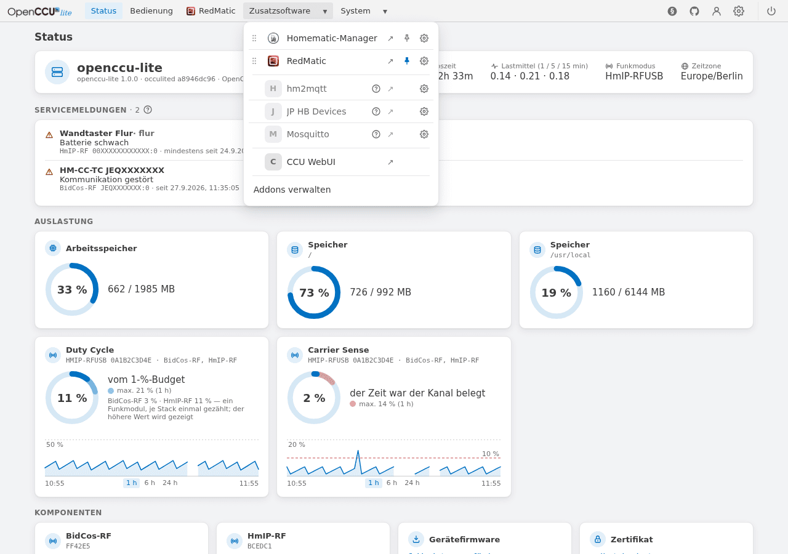

Der Pfeil neben **Zusatzsoftware** in der Kopfleiste öffnet das Menü der Addons. Oben stehen die Addons mit eigener
Oberfläche: ein Klick öffnet sie innerhalb der Weboberfläche, ↗ in einem neuen Tab, ⚙ ihre Einstellungen. Die Griffe
links ändern die Reihenfolge. Darunter die Addons ohne eigene Oberfläche (nur mit ihren Einstellungen), dann weitere
Links wie die alte CCU-WebUI und unten „Addons verwalten“, die Seite oben.

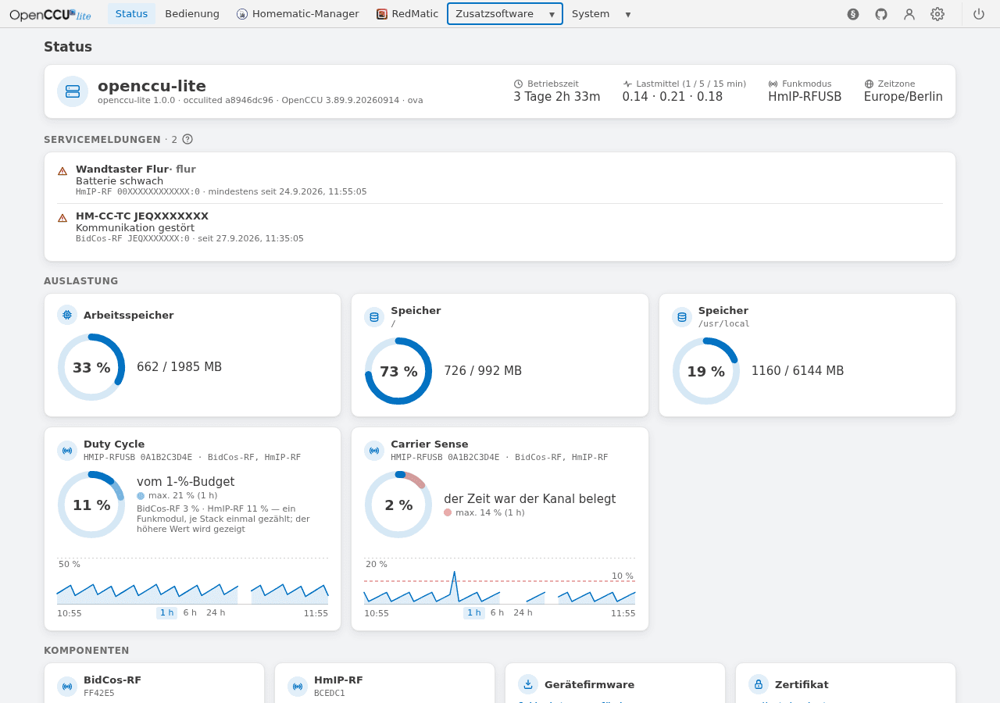

Im ersten Bild ist RedMatic schon angeheftet und steht mit seinem Symbol als eigener Reiter in der Kopfleiste. Die
**Stecknadel** neben dem Homematic Manager heftet auch ihn an: Er steht dann ebenfalls als Reiter zwischen Bedienung
und Zusatzsoftware, mit seinem eigenen Symbol, und ist mit einem Klick erreichbar. Ein zweiter Klick auf die
Stecknadel löst ein Addon wieder. Angeheftete Addons und ihre Reihenfolge gehören zum Benutzerkonto und gelten in
jedem Browser; auf den übrigen Bildern dieses Rundgangs sind beide angeheftet.

## Homematic Manager

openccu-lite hat keine eigene Geräteverwaltung. Anlernen, Konfigurieren und Direktverknüpfungen erledigt der
[Homematic Manager](https://github.com/hobbyquaker/homematic-manager#readme): auf openccu-lite ist er *das* Werkzeug
dafür. Er wird aus dem Katalog installiert und öffnet innerhalb der Weboberfläche, angeheftet als eigener Reiter oder
über das Menü der Zusatzsoftware. Die Bilder zeigen ihn mit seinen eigenen Beispieldaten.

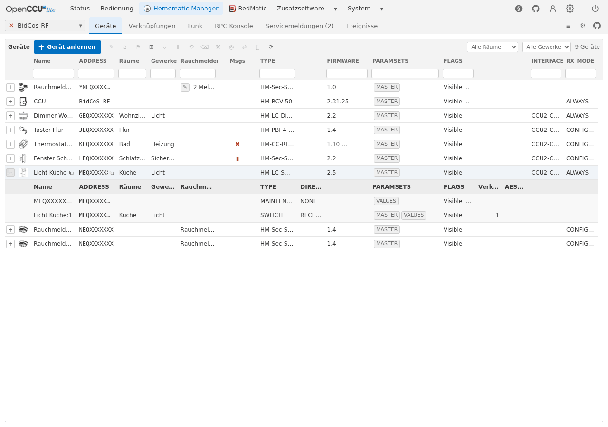

**Geräte:** alle Geräte einer Schnittstelle (oben links umschalten: BidCos-RF, HmIP-RF, Wired) mit Name, Adresse,
Räumen, Gewerken, Typ, Firmware und Paramsets; ein Gerät lässt sich aufklappen und zeigt seine Kanäle. Die Werkzeugleiste
benennt Geräte um, ordnet sie Räumen und Gewerken zu, repariert ihre Konfiguration, tauscht und löscht sie; eine
angebotene Firmware wird von hier aus installiert.

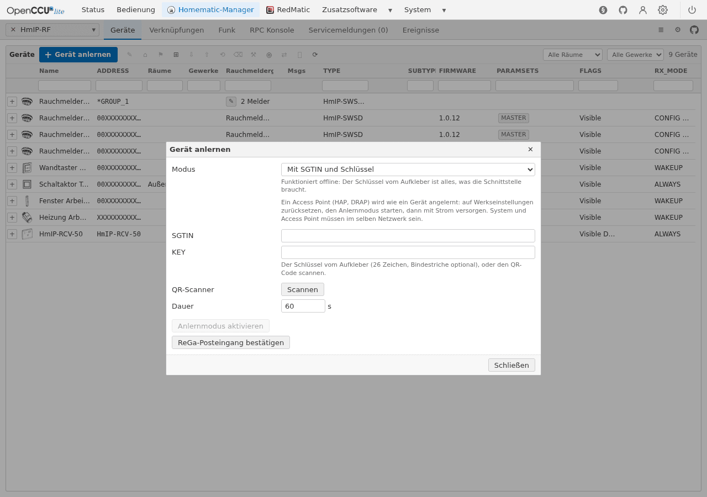

**Gerät anlernen:** für HmIP mit SGTIN und Schlüssel vom Aufkleber (auch per QR-Scanner), nur mit der SGTIN über den
Schlüsselserver oder ohne SGTIN im Anlernmodus; für BidCos im Anlernmodus oder über die Seriennummer. Access Points
(HAP, DRAP) werden wie Geräte angelernt.

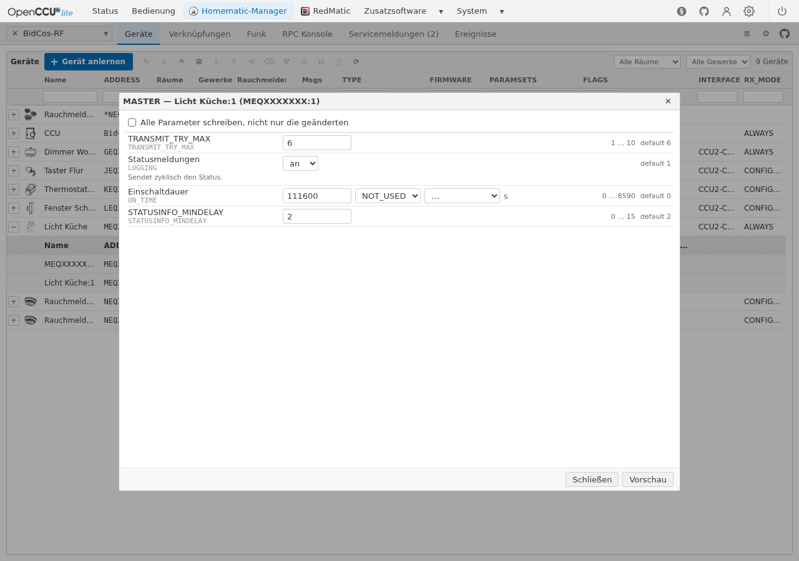

**Parameter:** ein Klick auf MASTER (oder VALUES) öffnet die Parameter eines Geräts oder Kanals mit Wertebereichen und
Standardwerten. „Vorschau“ zeigt vor dem Schreiben, was sich ändert.

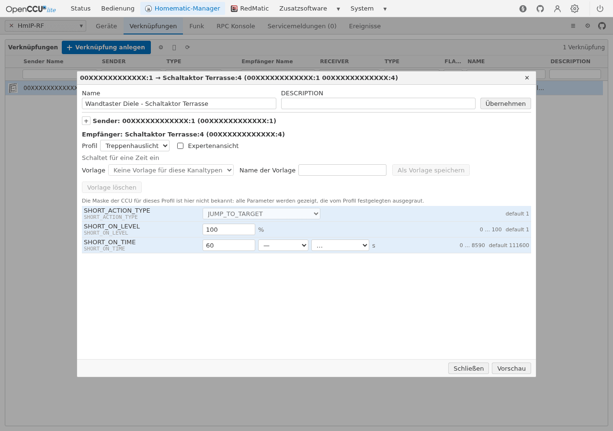

**Verknüpfungen:** Direktverknüpfungen zwischen Sender und Empfänger anlegen und bearbeiten, mit den Profilen wie auf
der CCU (hier „Treppenhauslicht“) oder in der Expertenansicht mit allen Parametern, dazu eigene Vorlagen.

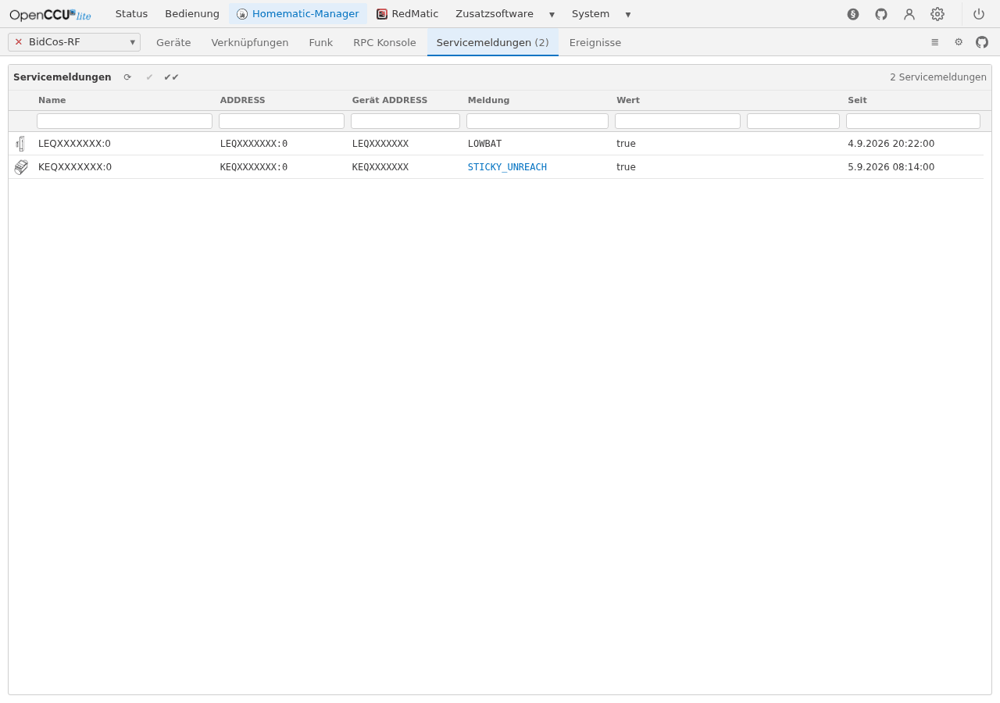

**Servicemeldungen:** die offenen Meldungen der Geräte einer Schnittstelle, etwa leere Batterien oder
Kommunikationsstörungen, zum Bestätigen. Weitere Reiter zeigen die Funkverbindungen (RSSI), eine RPC-Konsole und die
Ereignisse.

## Namen, Räume und Gewerke

Namen, Räume und Gewerke pflegen Sie direkt in der **Bedienung**; eine eigene Namensseite gibt es nicht mehr. Die beiden
Knöpfe unten in der linken Spalte öffnen die Kanäle, die noch keinem Raum und Gewerk zugeordnet sind, und die
Verwaltung der Räume und Gewerke:

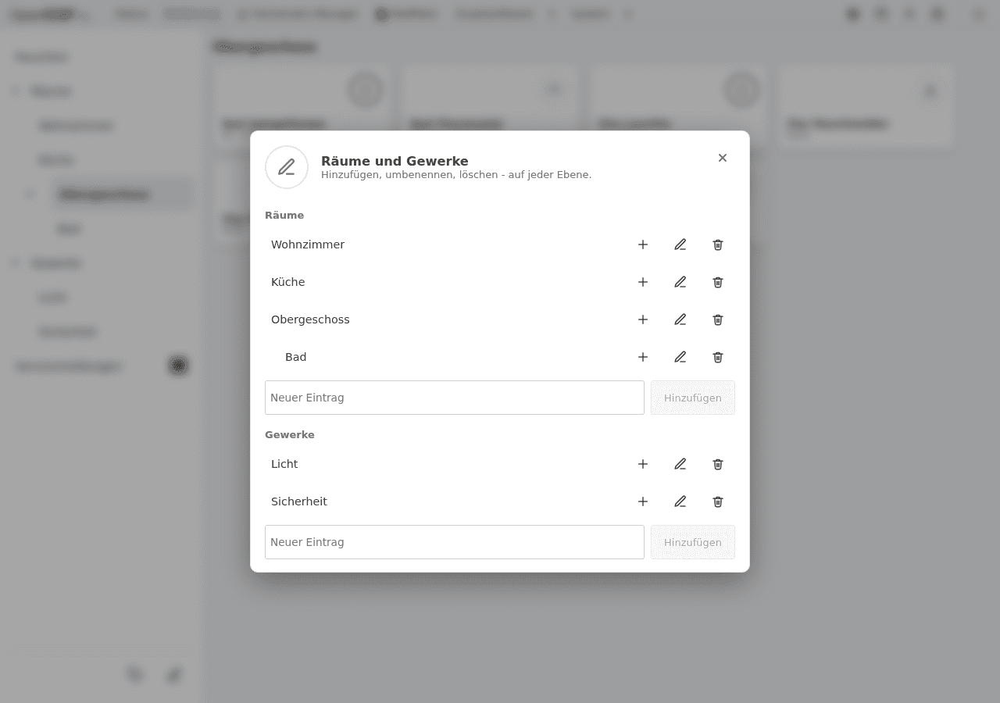

Räume und Gewerke hinzufügen, umbenennen und löschen, auf jeder Ebene: ein Raum kann weitere Räume enthalten
(Obergeschoss → Bad).

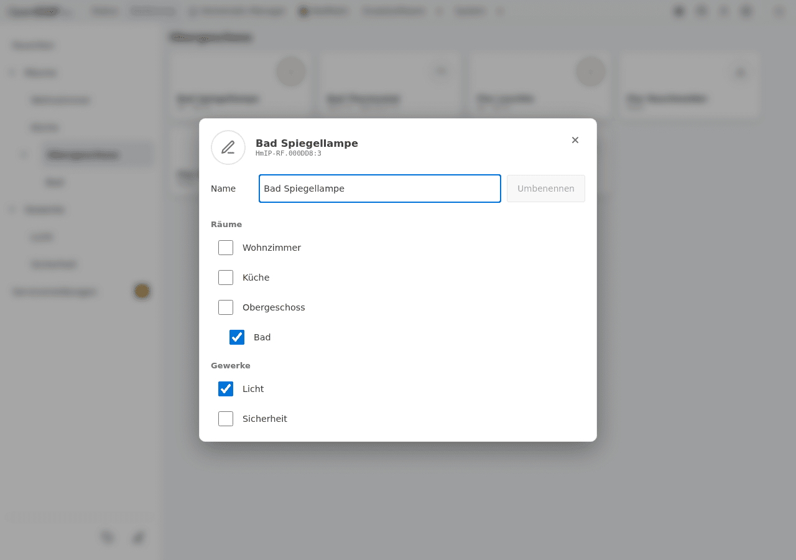

Ein langer Druck auf eine Kachel in einem Raum oder Gewerk öffnet ihren Kanal: hier bekommt er seinen Namen und seine
Räume und Gewerke. In den Favoriten und im Baum verschiebt ein langer Druck die Einträge in eine andere Reihenfolge. Namen,
Räume und Gewerke einer alten CCU übernimmt das System beim Wechsel oder über System → Sicherung; Addons wie der
Homematic Manager lesen und schreiben dieselben Namen.

## Auf dem Smartphone

Die Oberfläche passt sich an schmale Bildschirme an: Die Kopfleiste wird zweizeilig, Tabellen und Karten stehen
untereinander.

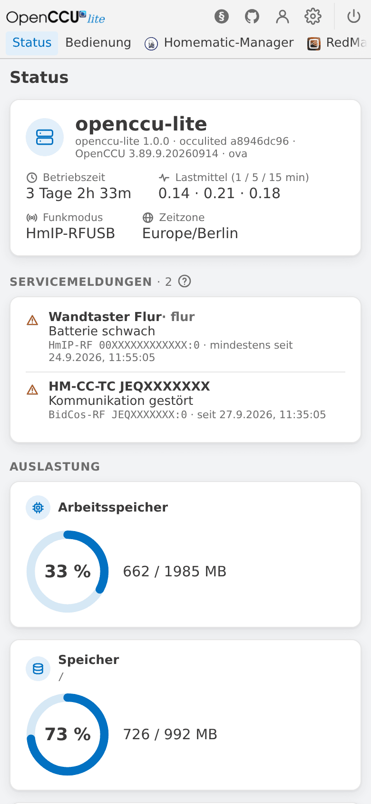


In der **Bedienung** liegen Räume, Gewerke und Favoriten hinter dem runden Knopf unten links; ein Tipp auf eine Kachel
öffnet die Bedienung des Kanals:


### Die Bedienung als eigene App

Die Bedienung lässt sich ohne Kopfleiste und System-Menü nutzen, wie eine eigene App:

1. Unter **Einstellungen → Bedienung** den Haken bei **„Bedienung als ganzes Fenster zeigen“** setzen (und als
   Startseite „Bedienung“ wählen). Die Reiterleiste und die Symbole verschwinden dann, solange die Bedienung offen ist.
2. Die Seite zum Startbildschirm hinzufügen: auf dem **iPhone** in Safari über das Teilen-Symbol **„Zum
   Home-Bildschirm“**, unter **Android** in Chrome über das Menü **„Zum Startbildschirm hinzufügen“** (oder „App
   installieren“). Das System bringt dafür ein App-Manifest mit: Das Symbol öffnet die Bedienung (`/app/`) in einem
   eigenen Fenster ohne Adressleiste.


So sieht die Bedienung dann aus: nur die Kacheln. Der runde Knopf öffnet das Menü mit Räumen und Gewerken; unten führen
die Symbole zurück zu Status, zum Konto und zu den Einstellungen:


## Dunkles Design

Jede Seite gibt es auch im dunklen Design, einzustellen unter Einstellungen → Design (oder wie das Betriebssystem es
vorgibt).


